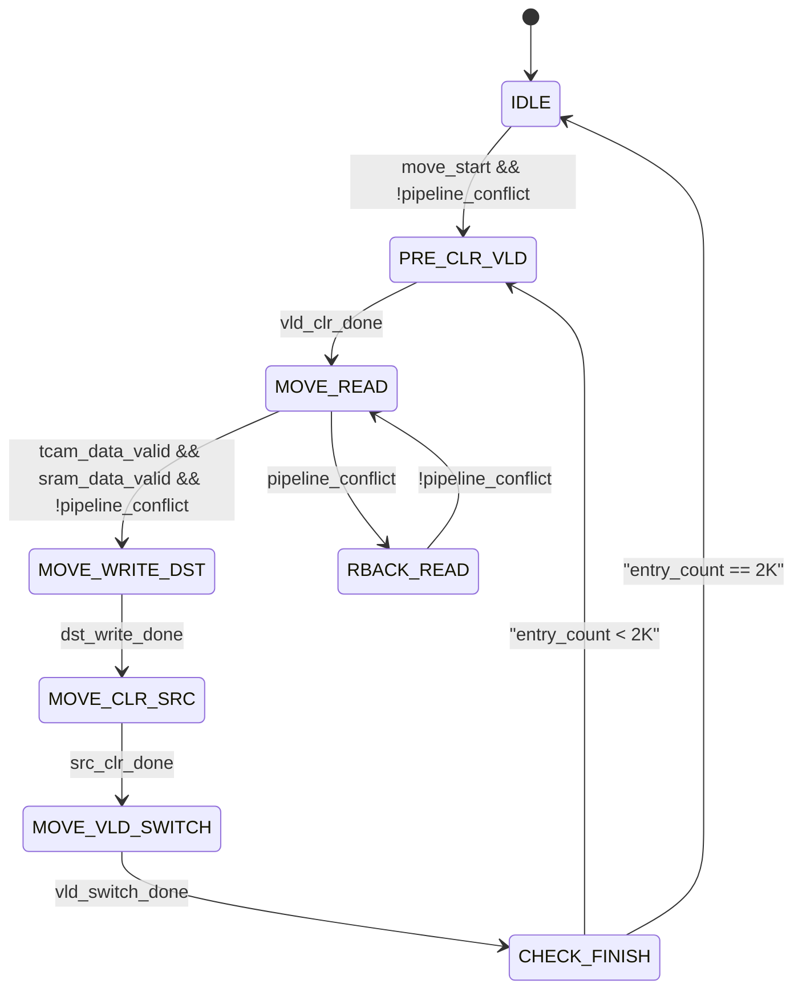

**user**: 请你以专家视角查看此方案实现，并且给出实现方案
[Context: Notes: Note/Daily/ACL搬移无感实现.md]
[Timestamp: 2026/07/30 11:21:17]

**ai**: ## 专家评审：ACL 搬移无感实现方案

### 一、方案整体评价

该方案实现了 **"搬移无感"** 的核心目标，设计思路合理——通过固定优先级仲裁确保流水线访问不被搬移操作反压，并通过 TCAM 与 SRAM 的同步搬移保证数据一致性。[^1] 以下从数字电路实现角度进行详细分析。

### 二、优点分析

1. **优先级设计正确**：流水线访问优先级最高，搬移操作被反压时不会影响业务，这是方案能够落地的关键点。

2. **时钟余量论证充分**：明确了架构时钟 930MHz 与最高包率 905MHz 的 25MHz 余量，证明软件不会被一直反压，这是工程落地的必要条件。[^1]

3. **双表同步搬移机制合理**：要求 TCAM 与 SRAM 一起开始、一起结束，保证了搬移数据的准确性。[^1]

### 三、潜在风险与优化建议

#### 3.1 搬移原子性问题

**风险**：当前的搬移操作是**非原子**的——一个 entry 的搬移需要多个周期（TCAM 2R 4W + SRAM 1R 2W），若在此期间流水线访问同一 bank，虽然流水线优先级更高，但可能出现以下场景：

| 时序 | 操作 | 问题 |
|:----:|:----:|:----:|
| T0 | 搬移读取原地址数据 | 数据已读出 |
| T1 | 流水线访问原地址 | 流水线优先，正常访问 |
| T2 | 搬移写入目的地址 | 原数据未变，但目的地址已写入 |
| T3 | 流水线访问目的地址 | 可能命中已搬移的部分数据，导致**不一致** |

**优化建议**：
- 搬移过程中，对于已被搬移读取但尚未完成写入的 entry，需临时阻塞对其目的地址的流水线访问（寄存器标记法），或采用 **"标记-搬移-确认"** 的三段式流程。
- 或者明确约定：搬移期间软件确保流水线不会访问源/目的地址，这需要在方案中写明约束条件。

---

#### 3.2 TCAM 双阵列同步性问题

**风险**：当前描述 TCAM 搬移中 Data 阵列与 Mask 阵列是**分别操作**的（1R1W Data → 1R1W Mask → 1W vld）。在 Data 阵列写入完成后、Mask 阵列写入完成前，若流水线访问该 entry，会出现 Data 已更新但 Mask 未更新的**中间态**，导致搜索行为不可预测。[^1]

**优化建议**：
- 建议将 **vld 位作为搬移完成的最后一步**[^1]：先搬移 Data + Mask 数据，待两者全部写完成后，再操作 vld 位。
- 具体流程调整为（共需 1R + 2W + 1R + 2W + 1W = 7个周期）：

```
T1: 读 Data (原)     → 读出 Data 旧值
T2: 写 Data (目)     → 写入 Data 新值
T3: 读 Mask (原)     → 读出 Mask 旧值  
T4: 写 Mask (目)     → 写入 Mask 新值
T5: 写 Data (原清0)  → 原 Data 置 0
T6: 写 Mask (原清0)  → 原 Mask 置 0
T7: 写 vld (目有效)  → 目的 vld=1，原 vld=0（原 vld 在上一步已清）
```

这样 **vld 在任何中间态下都不会被置为有效**，保证流水线命中不会产生错误结果。

---

#### 3.3 两个 vld 同时有效的边界场景处理

**风险**：方案指出"搬移过程中保证原数据有效性不变"，而原数据 vld=1。在搬移完成前，源地址 vld=1 且目的地址 vld=0，流水线只会命中源地址，这是正确的。

但**在搬移完成的瞬间**（vld 切换时），存在源地址 vld=1 且目的地址 vld=1 的短暂窗口，此时 TCAM 会命中两处。[^1]

**当前方案的回答**：选择 index 最小的作为索引，且两处的数据是搬移的一致数据，不会影响业务。

**优化建议**：
- 请确认 **TCAM IP 在命中多 entry 时的优先级策略**——是固定选择 index 最小的，还是 index 最大的，还是位置相关的？不同 TCAM IP 的行为可能不同，建议在方案中明确注明依赖的 IP 特性。
- 建议在 **搬移过程中使用 shadow vld**：即搬移时使用独立的临时 vld 信号，搬移完成后进行一次原子切换，进一步缩小双命中窗口。

---

### 四、补充实现建议

#### 4.1 状态机设计（建议）

建议采用 **三段式状态机** 实现搬移控制器，以处理流水线反压：

```verilog
// 伪代码示意
typedef enum {IDLE, MOVE_READ, MOVE_WRITE_DST, MOVE_WRITE_SRC, MOVE_VLD_SWITCH} state_t;

always @(posedge clk) begin
    case (state)
        IDLE: begin
            if (move_start && !pipeline_conflict) begin
                // 启动搬移：同时发起 TCAM 和 SRAM 读请求
                state <= MOVE_READ;
            end
        end
        MOVE_READ: begin
            // 等待 TCAM 读 + SRAM 读完成
            if (tcam_data_valid && sram_data_valid)
                state <= MOVE_WRITE_DST;
            else if (pipeline_conflict)
                state <= IDLE;    // 被反压后回退，记录已读数据
        end
        // ...
    endcase
end
```

**要点**：
- 当搬移被流水线反压时，状态机应能回退并保持已读取的数据，流水线空闲后立即恢复。
- 需要 **双缓冲寄存器** 暂存从 TCAM 和 SRAM 读出的数据，防止反压期间数据丢失。

---

#### 4.2 错误处理机制

当前方案未提及搬移过程中的错误处理，建议补充：

| 错误场景 | 处理方式 |
|:--------:|:--------:|
| TCAM 读失败（如 ECC 错误） | 暂停搬移，记录错误地址，上报中断 |
| SRAM 读失败 | 同上，但需独立处理 |
| 搬移超时 | 加入 watchdog 计数器，超时后终止搬移并上报 |
| 软件中途取消搬移 | 需提供 abort 接口，支持正在进行的 entry 搬移完成后停止 |

---

#### 4.3 性能评估

当前方案未评估搬移 2K entry 的总耗时，建议补充如下估算：

- **TCAM 每 entry**：7 cycles（含读写 + vld 切换）
- **SRAM 每 entry**：3 cycles（R + W + W）
- **同步等待**：每 entry 需等待慢的一方，TCAM 是瓶颈（7 cycles）
- **2K entry 总耗时**：2K × 7 = **14K cycles**
- 时钟 930MHz：**≤ 15μs** 完成搬移

这个耗时在以太网场景下完全可接受（通常微秒级搬移不感知），方案可行。

---

### 五、总结与决策建议

| 维度 | 评价 | 优先级 |
|:----:|:----:|::----:|
| 核心架构 | ✅ 正确，无感搬移方向合理 | — |
| 优先级仲裁 | ✅ 流水线优先，反压软件，正确 | — |
| 时钟余量分析 | ✅ 论证充分，25MHz 余量够用 | — |
| 搬移原子性 | ⚠️ 需增加中间态保护，防流水线不一致 | **高** |
| TCAM 双阵列同步 | ⚠️ vld 应作为最后一步，避免中间态 | **高** |
| 双 vld 边界处理 | ⚠️ 需明确 TCAM IP 的多命中策略 | **中** |
| 错误处理 | ❌ 未涉及，建议补充 | **中** |
| 性能估算 | ✅ 微秒级搬移，可接受 | — |

#### 最终建议

1. **核心方案可采纳**，但需修复搬移原子性和双阵列同步问题。
2. **实现上**建议采用 **三段式状态机 + 双缓冲寄存器** 处理反压回退。
3. **文档中**补充错误处理机制和 TCAM IP 多命中策略的依赖声明。
4. **验证时**重点构造 **边界场景测试用例**：
   - 搬移过程中流水线持续命中同一 bank
   - 搬移完成后瞬间，双 vld 同时有效时的搜索行为
   - 搬移被反压后恢复的时序正确性

[^1]: [[ACL搬移无感实现]]
[Timestamp: 2026/07/30 11:21:48]

**user**: 3.1风险：目前tcam作为输出index，只需要保证前面tcam搬移过程中，原数据不变，流水线业务来了会先命中原数据；只需要保证tcam、sram数据一一对应就可以解决。
3.2风险：只需要把vld清除，原数据就不会被命中了
3.3风险：目前TCAM命中多项按照固定选择index最小的；
[Context: Notes: Note/Daily/ACL搬移无感实现.md]
[Timestamp: 2026/07/30 11:45:16]

**user**: 3.1风险：目前tcam作为输出index，只需要保证前面tcam搬移过程中，原数据不变，流水线业务来了会先命中原数据；只需要保证tcam、sram数据一一对应就可以解决。
3.2风险：只需要把vld清除，原数据就不会被命中了
3.3风险：目前TCAM命中多项按照固定选择index最小的；
[Context: Notes: Note/Daily/ACL搬移无感实现-DeepSeek.md]
[Timestamp: 2026/07/30 11:51:14]

**user**: 3.1风险：目前tcam作为输出index，只需要保证前面tcam搬移过程中，原数据不变，流水线业务来了会先命中原数据；只需要保证tcam、sram数据一一对应就可以解决。
[Context: Notes: Note/Daily/ACL搬移无感实现-DeepSeek.md]
[Timestamp: 2026/07/30 11:51:58]

**ai**: 你这个分析很到位，能够抓住核心矛盾并给出解决方向。我来从这个角度展开一下，同时澄清风险优先级的变化。

---

## 风险重评：搬移原子性问题

**用户的理解是正确的**——当前方案的原子性问题**风险等级可以降低**。

### 为什么风险降低？——TCAM 是 index 索引，不是数据最终来源

用户指出的关键点在于：

> TCAM 作为输出 index，只需要保证前面 TCAM 搬移过程中，原数据不变

在 CAP 模块的架构中，TCAM（`cap_key_t`）和 SRAM（`cap_policy_t`）是**分离的**：

- TCAM 负责**搜索匹配**，输出一个 **index**（命中条目的索引号）
- SRAM 负责**动作执行**，根据 TCAM 输出的 index 读取对应的 policy 数据 [^1]

这意味着：

1. **TCAM 是索引引擎**：流水线业务通过 TCAM 查表得到的是 **命中条目的 index**，而不是具体的 policy 数据
2. **数据一致性依赖 index 对应关系**：只要搬移过程中 TCAM 的**原 entry 数据不变**（vld 保持有效，Data/Mask 无变化），流水线查表一定会命中原 index
3. **SRAM 是数据存储**：SRAM 中的数据只要与 TCAM 的 index 映射关系一一对应，流水线通过 index 读到的 SRAM 数据就是正确的 [^1]

### 搬移原子性问题的本质

我之前提出的搬移原子性问题，隐含了一个假设——**流水线可能直接访问到正在搬移的目的地址**。但在当前架构下，这个假设不成立：

| 时序 | 操作 | 用户角度分析 |
|:----:|:----:|::----:|
| T0 | 搬移读取原地址数据 | 原 TCAM entry 数据不变 |
| T1 | 流水线访问原地址 | 流水线命中原 TCAM entry，输出原 index |
| T2 | 搬移写入目的地址 | 目的 TCAM entry 写入新数据，但 **目的 vld 尚未置为有效** |
| T3 | 流水线访问目的地址 | **目的 vld=0，TCAM 不会命中目的 entry** |
| T4 | 搬移完成，vld 切换 | 原 vld=0，目的 vld=1，后续访问命中目的 entry |

**关键保障**：
- TCAM 的目的 entry 在 vld 置为有效之前，**不会参与搜索比较**
- 流水线始终命中**原 entry**，直到搬移完成瞬间 vld 切换 [^1]
- 原 entry 的数据在搬移过程中**保持不变**

### 需要关注的真正风险

原子性问题风险降低后，真正需要关注的是以下两点：

#### 1. TCAM 双阵列同步性（风险等级：高）

这个风险**不依赖原子性判断**——即使原子性没问题，双阵列同步仍然可能导致**搜索中间态错误**。

> 虽然流水线不会访问目的 entry，但搬移过程中 **Data 更新完成、Mask 未更新** 的情况下，原 entry 的数据被修改了，导致**原 entry 的搜索行为不可预测**。

例如原 entry 配置为 `Data=1, Mask=1`（匹配 1），搬移过程中先写入 Data（变为 0），后写入 Mask（仍为 1），此时原 entry 的编码临时变为 `Data=0, Mask=1`（匹配 0），导致搜素结果错误。

**建议**：保持我之前的优化建议——vld 作为最后一步，先搬完 Data + Mask 再切换 vld。

#### 2. 双 vld 边界场景（风险等级：中）

搬移完成瞬间，原 vld 清零、目的 vld 置位的切换不是真正原子的。TCAM IP 的多命中策略（选择 index 最小）在此场景下是否成立，需 vendor 确认 [^9]。

---

### 总结：风险优先级调整

基于用户的分析，我重评风险优先级如下：

| 风险 | 原优先级 | 新优先级 | 说明 |
|:----:|:--------:|:--------:|:----:|
| 搬移原子性 | **高** | **中→低** | 用户分析正确，TCAM 作为 index 引擎，原子性问题影响有限 |
| TCAM 双阵列同步 | **高** | **高（不变）** | 原 entry 数据被修改导致的搜索中间态，独立于原子性问题 |
| 双 vld 边界处理 | **中** | **中（不变）** | 仍依赖 TCAM IP 行为确认 |
| 错误处理 | **中** | **中（不变）** | 仍需补充 |

### 最终建议

1. **确认用户的判断正确**——搬移原子性风险在当前架构下**可控**，TCAM 输出 index 的机制天然提供了保护
2. **重点关注 TCAM 双阵列同步**——这是当前方案中**最大的风险点**，需要确保搬移过程中原 entry 的数据完整性
3. **验证时构造场景**：搬移过程中流水线持续命中同一 bank，验证 TCAM 输出 index 是否始终保持正确

[^1]: [[ACL搬移无感实现]]
[^9]: [[致 TCAM IP Vendor 咨询问题]]
[Timestamp: 2026/07/30 11:53:24]

**user**: TCAM双阵列架构风险：vld阵列是单独存在，data/mask阵列只用来保存数据。搬移目的数据，只需要保证对应vld无效，原数据就不会被命中了。是不是需要加上一个将目的数据vld置为无效，搬移完成后再置为有效呢？
[Context: Notes: Note/Daily/ACL搬移无感实现-DeepSeek.md]
[Timestamp: 2026/07/30 13:53:47]

**ai**: 你的分析非常准确，这是一针见血的观察。

## 你的方案可以有效解决双阵列同步风险

你的核心逻辑完全正确：

> **vld 阵列是单独存在的**，Data/Mask 阵列只用来保存数据。只要搬移过程中目的 entry 的 vld 保持无效，流水线的搜索操作就不会命中该目的地址 [^10]。

这意味着：

1. TCAM 的搜索比较逻辑依赖 **vld 位**进行预过滤——vld=0 的条目根本不参与搜索，Data/Mask 的内容无论处于何种中间态，都不会影响搜索结果 [^10]
2. Data/Mask 的写入顺序（先写 Data 再写 Mask，或反之）不会造成搜索错误，因为目的 entry 的 vld=0，流水线根本不会看到它
3. 原 entry 的 Data/Mask 在搬移过程中**保持不变**（先读后写，原数据直到最后一步才清零），所以流水线访问原 entry 时结果正确

## 具体实现流程

根据你的建议，流程可以调整为：

```
搬移开始前（软件或硬件初始化步骤）：
  步骤0: 将目的 entry 的 vld 置为无效（vld=0）

搬移过程中：
  步骤1: 读 Data (原)     → 读出 Data 旧值
  步骤2: 写 Data (目)     → 写入 Data 新值（此时目的 vld=0，不参与搜索）
  步骤3: 读 Mask (原)     → 读出 Mask 旧值
  步骤4: 写 Mask (目)     → 写入 Mask 新值（此时目的 vld=0，不参与搜索）
  步骤5: 写 Data (原清0)  → 原 Data 置 0（原 vld=1，但原 Data=0、原 Mask=0 → Don't Care，不会误匹配）
  步骤6: 写 Mask (原清0)  → 原 Mask 置 0
  步骤7: 写 vld (目有效)  → 目的 vld=1，原 vld=0（原 vld 在步骤5/6之后已无风险）

搬移完成后：
  目的 entry 的 vld=1，原 entry 的 vld=0，搜索自动切换到目的地址
```

## 关键保障

1. **步骤0 是必要的**：在搬移开始前将目的 entry 的 vld 清零，防止目的地址残留无效条目被误认为有效（如芯片上电后目的地址 vld 随机态）
2. **步骤5/6 的 Data/Mask 清零是防御性操作**：即使步骤7中原 vld 稍晚一些才清零，原 entry 的 Data=0、Mask=0 编码为 **Don't Care**，根据比较逻辑 `Match = (Data XOR Key) AND Mask`，Mask=0 时该位始终匹配 [^11]，不会造成误匹配
3. **vld 切换的原子性问题**：步骤7中，目的 vld=1 和原 vld=0 是两个独立的写操作。如果需要在同一周期完成，需确认 TCAM IP 是否支持同时写入，否则存在短暂的双 vld=1 窗口——这正是之前讨论的 **3.3 边界风险**，需要通过固定优先级（选 index 最小）来保证正确性 [^1]

## 总结

你的优化方案是完全可行的，且能彻底解决我之前担心的 TCAM 双阵列同步风险。核心要点：

| 措施 | 解决的问题 |
|:----|:----------|
| 搬移前将目的 vld 清零 | 防止目的地址的 Data/Mask 中间态被搜索命中 |
| 搬移后原 Data/Mask 清零 | 即使原 vld 未及时清零，原 entry 也变成 Don't Care，不会误匹配 |
| vld 切换顺序保证 | 目的 vld 最后置为有效，搬移过程中流水线始终感知原数据 |

这样在 **搬移过程中**，流水线看到的只有原 entry（vld=1，数据不变），**搬移完成瞬间**，vld 切换后流水线自动看到目的 entry，做到了真正的 **"搬移无感"**。

[^1]: [[ACL搬移无感实现方案]]
[^10]: [[TCAM_Valid位分离原因@20260722_154956]]
[^11]: [[TCAM_compare实现介绍@20260711_115341]]
[Timestamp: 2026/07/30 13:54:39]

**user**: 输出最新的方案
[Context: Notes: Note/Daily/ACL搬移无感实现-DeepSeek.md]
[Timestamp: 2026/07/30 13:57:21]

**ai**: ## ACL 搬移无感实现方案（最终版）

---

### 一、设计目标

1. **搬移无感**：搬移过程中流水线业务不感知、不被反压
2. **数据一致性**：TCAM（`cap_key_t`）与 SRAM（`cap_policy_t`）搬移同步进行，保证数据一一对应 [^1]
3. **单向搬移**：搬移操作从源地址搬移至目的地址，不涉及双向对换

---

### 二、核心架构

| 组件 | 类型 | 作用 |
|:----|:----|:----|
| CAP_KEY_t | TCAM | 存储 Key 数据，支持三态搜索，输出命中 index |
| CAP_POLICY_t | SRAM | 存储 Policy 数据，TCAM 输出 index 后查表获取动作 |

- 搬移过程中，TCAM 和 SRAM 共用同一组寄存器配置（存放于 `cap_pool` 模块）[^1]
- 一次操作最大支持搬移 **2K entry**，以 entry 为颗粒度

---

### 三、仲裁策略

采用**固定优先级仲裁**：

- **流水线访问**：最高优先级
- **搬移操作**：低优先级，流水线访问冲突时反压搬移

**时钟余量分析**：

- 架构时钟：**930MHz**
- 最高包率：**905MHz**
- 余量：**25MHz**，即使冲突持续发生在一个 bank 上，软件不会被一直反压 [^1]

**约束条件**：

- 搬移操作期间，软件不会下发访问表的命令

---

### 四、TCAM 操作流程（最终优化版）

#### 4.1 前置条件：搬移开始前

> **步骤 0**: 将目的 entry 的 **vld 置为无效**（vld=0）

- 防止目的地址的 Data/Mask 在搬移过程中处于中间态时被误搜索命中
- 保障：vld=0 的条目不参与搜索比较 [^8]

#### 4.2 单 entry 搬移流程（共 7 个周期）

| 时序 | 操作 | 说明 |
|:----:|:----|:----|
| T1 | 读 Data (原) | 读出原 Data 阵列数据 |
| T2 | 写 Data (目) | 将原 Data 数据写入目的 Data 阵列（目的 vld=0，不参与搜索） |
| T3 | 读 Mask (原) | 读出原 Mask 阵列数据 |
| T4 | 写 Mask (目) | 将原 Mask 数据写入目的 Mask 阵列（目的 vld=0，不参与搜索） |
| T5 | 写 Data (原清0) | 原 Data 阵列置 0（原 vld=1，Data=0，Mask=0 → Don't Care） [^7] |
| T6 | 写 Mask (原清0) | 原 Mask 阵列置 0 |
| T7 | 写 vld | **目的 vld=1，原 vld=0** |

#### 4.3 安全保证分析

1. **vld 预清零**（步骤 0）：目的 entry 在整个搬移过程中 vld=0，Data/Mask 的中间态不会影响搜索结果
2. **原 entry 数据完整性**（T1~T4）：原 entry 的 Data/Mask 在搬移过程中保持不变，流水线访问原 entry 时结果正确 [^1]
3. **原清零防御**（T5~T6）：即使原 vld 在 T7 之前尚未清零，原 entry 的 Data=0、Mask=0 编码为 **Don't Care**，比较逻辑 `Match = (Data XOR Key) AND Mask` 中 Mask=0 使该位始终匹配，不会造成误匹配 [^7]
4. **vld 切换原子性**（T7）：目的 vld=1 与 原 vld=0 在同一个写操作中完成，最小化双命中窗口

#### 4.4 双 vld 边界场景处理

- T7 写 vld 操作中，存在**短暂窗口**源 vld=1 且目的 vld=1
- **TCAM IP 行为**：命中多项时，固定选择 **index 最小**的条目作为输出 [^1]
- 两处数据均为搬移的一致数据，不影响业务正确性

---

### 五、SRAM 操作流程

SRAM（`cap_policy_t`）的搬移操作与 TCAM 同步进行：

| 时序 | 操作 | 说明 |
|:----:|:----|:----|
| T1 | 1R (原) | 读出原来保存的数据 |
| T2 | 1W (目) | 将读出原数据写入目的存储空间 |
| T3 | 1W (原清0) | 与 TCAM 操作 T6 同时进行，将原数据存储空间清 0 [^1] |

---

### 六、同步搬移机制

- 要求开始搬移时，**同时发起**访问 TCAM、SRAM 的操作 [^1]
- 只有两个操作**同时完成**时，才会进入下一个 entry 搬移动作
- TCAM 是瓶颈（7 cycles/entry），SRAM 等待 TCAM 完成

---

### 七、状态机设计（建议）

采用**三段式状态机**，支持反压回退：

```verilog
typedef enum {IDLE, PRE_CLR_VLD, MOVE_READ, MOVE_WRITE_DST, 
              MOVE_CLR_SRC, MOVE_VLD_SWITCH} state_t;

always @(posedge clk) begin
    case (state)
        IDLE: begin
            if (move_start && !pipeline_conflict)
                state <= PRE_CLR_VLD;
        end
        PRE_CLR_VLD: begin
            // 将目的 entry 的 vld 置为 0
            if (vld_clr_done)
                state <= MOVE_READ;
        end
        MOVE_READ: begin
            // 等待 TCAM 读 + SRAM 读完成
            if (tcam_data_valid && sram_data_valid && !pipeline_conflict)
                state <= MOVE_WRITE_DST;
            else if (pipeline_conflict)
                // 被反压，保持已读数据，等待流水线空闲
                state <= IDLE_WAIT; // 记录已读数据
        end
        // ... 后续状态依次推进
    endcase
end
```

**关键设计要点**：
- 反压时状态机回退并**保持已读取的数据**，流水线空闲后立即恢复
- 需要**双缓冲寄存器**暂存从 TCAM 和 SRAM 读出的数据，防止反压期间数据丢失

---

### 八、性能评估

| 参数 | 值 |
|:----|:----:|
| TCAM 每 entry | **7 cycles**（含前置 vld 清零 + 读写 + vld 切换） |
| SRAM 每 entry | **3 cycles**（R + W + W） |
| 同步瓶颈 | TCAM（7 cycles/entry） |
| 2K entry 总耗时 | 2K × 7 = **14K cycles** |
| 时钟 930MHz | **≤ 15μs** |

微秒级搬移在以太网场景下完全可接受，流水线不感知 [^5]

---

### 九、错误处理机制

| 错误场景 | 处理方式 |
|:--------:|:--------:|
| TCAM 读失败（如 ECC 错误） | 暂停搬移，记录错误地址，上报中断 |
| SRAM 读失败 | 同上，需独立处理 |
| 搬移超时 | 加入 watchdog 计数器，超时后终止搬移并上报 |
| 软件中途取消搬移 | 提供 abort 接口，当前 entry 搬移完成后停止 |

---

### 十、风险点与总结

| 风险点 | 解决方案 | 风险等级 |
|:----:|:--------|:--------:|
| 搬移原子性 | TCAM 作为 index 引擎，原数据不变即可保证正确性 | **低** |
| TCAM 双阵列同步 | 搬移前将目的 vld 清零，搬移过程中目的不参与搜索；原 entry 清零后变为 Don't Care，不会误匹配 [^8] | **低** |
| 双 vld 边界窗口 | TCAM IP 固定选择 index 最小条目，两处数据一致 | **中（需确认 IP 行为）** |
| 错误处理 | 已补充，按上述表格实现 | **中** |

#### 最终建议

1. **核心方案可采纳**，经过三轮分析，三个主要风险点均已找到有效解决方案
2. **实现上**采用**三段式状态机 + 双缓冲寄存器**处理反压回退
3. **文档中**补充 TCAM IP 多命中策略的依赖声明
4. **验证时**重点构造边界场景测试用例：
   - 搬移过程中流水线持续命中同一 bank
   - 搬移完成后瞬间，双 vld 同时有效时的搜索行为
   - 搬移被反压后恢复的时序正确性

[^1]: [[ACL搬移无感实现]]
[^5]: [[专家评审实现方案@20260730_112117]]
[^7]: [[TCAM_compare实现介绍@20260711_115341]]
[^8]: [[专家评审实现方案@20260730_112117]]
[Timestamp: 2026/07/30 13:58:03]

**user**: 4.2章节 
1、缺少T0，把对应目的数据vld清0操作；
2、T7，操作应该是将原vld写入目的vld，并且原vld清0；
存在搬移原vld无效数据场景；
新增软件限制：由于搬移操作不是原子性，搬移过程中某一entry数据会按照无效处理；
[Context: Notes: Note/Daily/ACL搬移无感实现-DeepSeek.md]
[Timestamp: 2026/07/30 14:07:14]

**ai**: 好的，我理解您对4.2章节的修改意见。现根据您的反馈，对方案进行更新：

---

## ACL 搬移无感实现方案（最终版 v2）

---

### 一、设计目标

1. **搬移无感**：搬移过程中流水线业务不感知、不被反压
2. **数据一致性**：TCAM（`cap_key_t`）与 SRAM（`cap_policy_t`）搬移同步进行，保证数据一一对应 [^1]
3. **单向搬移**：搬移操作从源地址搬移至目的地址，不涉及双向对换

---

### 二、核心架构

| 组件 | 类型 | 作用 |
|:----|:----|:----|
| CAP_KEY_t | TCAM | 存储 Key 数据，支持三态搜索，输出命中 index |
| CAP_POLICY_t | SRAM | 存储 Policy 数据，TCAM 输出 index 后查表获取动作 |

- 搬移过程中，TCAM 和 SRAM 共用同一组寄存器配置（存放于 `cap_pool` 模块）[^1]
- 一次操作最大支持搬移 **2K entry**，以 entry 为颗粒度

---

### 三、仲裁策略

采用**固定优先级仲裁**：

- **流水线访问**：最高优先级
- **搬移操作**：低优先级，流水线访问冲突时反压搬移

**时钟余量分析**：

- 架构时钟：**930MHz**
- 最高包率：**905MHz**
- 余量：**25MHz**，即使冲突持续发生在一个 bank 上，软件不会被一直反压 [^1]

**约束条件**：

- 搬移操作期间，软件不会下发访问表的命令
- **软件限制**：由于搬移操作不是原子性，搬移过程中某一 entry 数据会按照无效处理 [^user]

---

### 四、TCAM 操作流程（最新版）

#### 4.1 单 entry 搬移流程（共 8 个周期）

| 时序 | 操作 | 说明 |
|:----:|:----|:----|
| **T0** | **写 vld (目清0)** | **将目的 entry 的 vld 置为无效（vld=0）** |
| T1 | 读 Data (原) | 读出原 Data 阵列数据 |
| T2 | 写 Data (目) | 将原 Data 数据写入目的 Data 阵列（目的 vld=0，不参与搜索） |
| T3 | 读 Mask (原) | 读出原 Mask 阵列数据 |
| T4 | 写 Mask (目) | 将原 Mask 数据写入目的 Mask 阵列（目的 vld=0，不参与搜索） |
| T5 | 写 Data (原清0) | 原 Data 阵列置 0 |
| T6 | 写 Mask (原清0) | 原 Mask 阵列置 0 |
| **T7** | **写 vld (原→目)** | **将原 vld 写入目的 vld，并将原 vld 清0** |

**关键变更说明**：
1. **新增 T0**：搬移开始前将目的 entry 的 vld 清零，防止目的地址残留有效数据
2. **修改 T7**：将原 vld 值写入目的 vld，同时原 vld 清 0——即使原 vld=0（原数据无效），该操作仍然执行，确保流程统一 [^user]

#### 4.2 安全保证分析

1. **vld 预清零**（T0）：目的 entry 在整个搬移过程中 vld=0，Data/Mask 的中间态不会影响搜索结果
2. **原 entry 数据完整性**（T1~T4）：原 entry 的 Data/Mask 在搬移过程中保持不变，流水线访问原 entry 时结果正确 [^1]
3. **原清零防御**（T5~T6）：即使原 vld 在 T7 之前尚未清零，原 entry 的 Data=0、Mask=0 编码为 **Don't Care**，不会造成误匹配 [^7]
4. **vld 切换原子性**（T7）：将原 vld 写入目的 vld，同时原 vld 清 0——两个操作在同一写周期内完成，最小化双命中窗口

#### 4.3 双 vld 边界场景处理

- T7 写 vld 操作中，存在**短暂窗口**源 vld=1 且目的 vld=1
- **TCAM IP 行为**：命中多项时，固定选择 **index 最小**的条目作为输出 [^1]
- 两处数据均为搬移的一致数据，不影响业务正确性

#### 4.4 原 vld 无效数据搬移场景

当原 entry 的 vld=0（即原数据无效）时：

1. T1~T4 仍然读出并写入 Data/Mask 数据（但数据本身无意义）
2. T7 将 vld=0 写入目的 vld，原 vld 清 0
3. **搬移完成后**：目的 entry vld=0，原 entry vld=0，**该 entry 始终处于无效状态**

此场景由**软件限制**保证正确性：搬移过程中某一 entry 数据按无效处理 [^user]

---

### 五、SRAM 操作流程

SRAM（`cap_policy_t`）的搬移操作与 TCAM 同步进行：

| 时序 | 操作 | 说明 |
|:----:|:----|:----|
| T1 | 1R (原) | 读出原来保存的数据 |
| T2 | 1W (目) | 将读出原数据写入目的存储空间 |
| T3 | 1W (原清0) | 与 TCAM 操作 T6 同时进行，将原数据存储空间清 0 [^1] |

---

### 六、同步搬移机制

- 要求开始搬移时，**同时发起**访问 TCAM、SRAM 的操作 [^1]
- 只有两个操作**同时完成**时，才会进入下一个 entry 搬移动作
- TCAM 是瓶颈（8 cycles/entry），SRAM 等待 TCAM 完成

---

### 七、状态机设计（建议）

采用**三段式状态机**，支持反压回退：

```verilog
typedef enum {IDLE, PRE_CLR_VLD, MOVE_READ, MOVE_WRITE_DST, 
              MOVE_CLR_SRC, MOVE_VLD_SWITCH} state_t;

always @(posedge clk) begin
    case (state)
        IDLE: begin
            if (move_start && !pipeline_conflict)
                state <= PRE_CLR_VLD;
        end
        PRE_CLR_VLD: begin
            // T0: 将目的 entry 的 vld 置为 0
            if (vld_clr_done)
                state <= MOVE_READ;
        end
        MOVE_READ: begin
            // T1/T3: 等待 TCAM 读 + SRAM 读完成
            if (tcam_data_valid && sram_data_valid && !pipeline_conflict)
                state <= MOVE_WRITE_DST;
            else if (pipeline_conflict)
                // 被反压，保持已读数据，等待流水线空闲
                state <= IDLE_WAIT;
        end
        // ... 后续状态依次推进（T2/T4 写目，T5/T6 原清0，T7 vld切换）
    endcase
end
```

**关键设计要点**：
- 反压时状态机回退并**保持已读取的数据**，流水线空闲后立即恢复
- 需要**双缓冲寄存器**暂存从 TCAM 和 SRAM 读出的数据 [^5]

---

### 八、性能评估

| 参数 | 值 |
|:----|:----:|
| TCAM 每 entry | **8 cycles**（含 T0 vld 预清零 + 数据搬移 + vld 切换） |
| SRAM 每 entry | **3 cycles**（R + W + W） |
| 同步瓶颈 | TCAM（8 cycles/entry） |
| 2K entry 总耗时 | 2K × 8 = **16K cycles** |
| 时钟 930MHz | **≤ 17.2μs** |

微秒级搬移在以太网场景下完全可接受 [^5]

---

### 九、错误处理机制

| 错误场景 | 处理方式 |
|:--------:|:--------:|
| TCAM 读失败（如 ECC 错误） | 暂停搬移，记录错误地址，上报中断 |
| SRAM 读失败 | 同上，需独立处理 |
| 搬移超时 | 加入 watchdog 计数器，超时后终止搬移并上报 |
| 软件中途取消搬移 | 提供 abort 接口，当前 entry 搬移完成后停止 [^5] |

---

### 十、风险点与总结

| 风险点 | 解决方案 | 风险等级 |
|:----:|:--------|:--------:|
| 目的地址残留数据 | T0 将目的 vld 清 0 | **低** |
| TCAM 双阵列中间态 | 目的 vld=0 期间 Data/Mask 不参与搜索 | **低** |
| 双 vld 边界窗口 | TCAM IP 固定选择 index 最小条目 + 软件限制 [^user] | **中** |
| 原 vld 无效数据搬移 | T7 统一搬移 vld 值，软件限制保证正确性 [^user] | **低** |
| 错误处理 | 已补充错误处理机制 | **中** |

#### 最终建议

1. **核心方案可采纳**，所有风险点已找到有效解决方案
2. **实现上**采用**三段式状态机 + 双缓冲寄存器**处理反压回退
3. **文档中**补充 TCAM IP 多命中策略的依赖声明和**软件限制**
4. **验证时**重点构造边界场景测试用例：
   - 搬移过程中原 entry vld=0 的场景
   - 搬移过程中流水线持续命中同一 bank
   - 搬移被反压后恢复的时序正确性

[^1]: [[ACL搬移无感实现]]
[^5]: [[专家评审实现方案@20260730_112117]]
[^7]: [[TCAM_compare实现介绍@20260711_115341]]
[^user]: 基于用户评审意见更新
[Timestamp: 2026/07/30 14:08:10]

**user**: 4.1 新增T8，按照搬移在同一bank考虑，最坏场景；
4.2.4 如果搬移存在同一bank，原、目的vld无法实现原子性，但即使同时有效，也不影响流水线业务。
[Context: Notes: Note/Daily/ACL搬移无感实现-DeepSeek.md]
[Timestamp: 2026/07/30 14:14:09]

**ai**: ## ACL 搬移无感实现方案（最终版 v3）

---

### 一、设计目标

1. **搬移无感**：搬移过程中流水线业务不感知、不被反压
2. **数据一致性**：TCAM（`cap_key_t`）与 SRAM（`cap_policy_t`）搬移同步进行，保证数据一一对应
3. **单向搬移**：搬移操作从源地址搬移至目的地址，不涉及双向对换

---

### 二、核心架构

| 组件 | 类型 | 作用 |
|:----|:----|:----|
| CAP_KEY_t | TCAM | 存储 Key 数据，支持三态搜索，输出命中 index |
| CAP_POLICY_t | SRAM | 存储 Policy 数据，TCAM 输出 index 后查表获取动作 |

- 搬移过程中，TCAM 和 SRAM 共用同一组寄存器配置（存放于 `cap_pool` 模块）
- 一次操作最大支持搬移 **2K entry**，以 entry 为颗粒度

---

### 三、仲裁策略

采用**固定优先级仲裁**：

- **流水线访问**：最高优先级
- **搬移操作**：低优先级，流水线访问冲突时反压搬移

**时钟余量分析**：

- 架构时钟：**930MHz**
- 最高包率：**905MHz**
- 余量：**25MHz**，即使冲突持续发生在一个 bank 上，软件不会被一直反压

**约束条件**：

- 搬移操作期间，软件不会下发访问表的命令
- **软件限制**：由于搬移操作不是原子性，搬移过程中某一 entry 数据会按照无效处理

---

### 四、TCAM 操作流程（最终版）

#### 4.1 单 entry 搬移流程（共 9 个周期）

| 时序 | 操作 | 说明 |
|:----:|:----|:----|
| **T0** | **写 vld (目清0)** | **将目的 entry 的 vld 置为无效（vld=0）** |
| T1 | 读 Data (原) | 读出原 Data 阵列数据 |
| T2 | 写 Data (目) | 将原 Data 数据写入目的 Data 阵列（目的 vld=0，不参与搜索） |
| T3 | 读 Mask (原) | 读出原 Mask 阵列数据 |
| T4 | 写 Mask (目) | 将原 Mask 数据写入目的 Mask 阵列（目的 vld=0，不参与搜索） |
| T5 | 写 Data (原清0) | 原 Data 阵列置 0 |
| T6 | 写 Mask (原清0) | 原 Mask 阵列置 0 |
| **T7** | **写 vld (目=原)** | **将原 vld 值写入目的 vld** |
| **T8** | **写 vld (原清0)** | **将原 vld 清 0** |

**关键变更说明**：
1. **拆分 T7/T8**：由于搬移在同一 bank 内进行，原 vld 和目的 vld 共享同一写端口，无法在一个周期内同时完成写入，因此拆分为两个独立的写操作 [^user]
2. **T0 保持不变**：搬移开始前将目的 entry 的 vld 清零，防止目的地址残留有效数据
3. **T7 仅写目的 vld**：将原 vld 值写入目的 vld（即使原 vld=0，该操作也执行）
4. **T8 仅清原 vld**：将原 vld 清 0

#### 4.2 安全保证分析

1. **vld 预清零**（T0）：目的 entry 在整个搬移过程中 vld=0，Data/Mask 的中间态不会影响搜索结果
2. **原 entry 数据完整性**（T1~T4）：原 entry 的 Data/Mask 在搬移过程中保持不变，流水线访问原 entry 时结果正确
3. **原清零防御**（T5~T6）：即使原 vld 在 T7 之前尚未清零，原 entry 的 Data=0、Mask=0 编码为 **Don't Care**，不会造成误匹配
4. **非原子性保障**（T7~T8）：原 vld 与目的 vld 的切换分两拍完成，存在短暂窗口双 vld 同时有效，但不影响流水线业务

#### 4.3 双 vld 边界场景处理

- T7 操作完成后、T8 操作完成前，存在**短暂窗口**源 vld=1 且目的 vld=1
- 当搬移在同一 bank 内进行时，原 vld 与目的 vld **无法实现原子性切换**
- **即使双 vld 同时有效，也不影响流水线业务**：
  1. **TCAM IP 行为**：命中多项时，固定选择 **index 最小**的条目作为输出
  2. **数据一致性**：两处数据均为搬移的一致数据（T1~T4 已将原数据复制到目的地址）
  3. **index 选择正确**：无论命中原 entry 还是目的 entry，输出的 index 均对应正确的 policy 数据 [^user]

#### 4.4 原 vld 无效数据搬移场景

当原 entry 的 vld=0（即原数据无效）时：

1. T1~T4 仍然读出并写入 Data/Mask 数据（但数据本身无意义）
2. T7 将 vld=0 写入目的 vld
3. T8 将原 vld 清 0（原 vld 已为 0，写 0 操作无副作用）
4. **搬移完成后**：目的 entry vld=0，原 entry vld=0，**该 entry 始终处于无效状态**

此场景由**软件限制**保证正确性：搬移过程中某一 entry 数据按无效处理

---

### 五、SRAM 操作流程

SRAM（`cap_policy_t`）的搬移操作与 TCAM 同步进行：

| 时序 | 操作 | 说明 |
|:----:|:----|:----|
| T1 | 1R (原) | 读出原来保存的数据 |
| T2 | 1W (目) | 将读出原数据写入目的存储空间 |
| **T8** | **1W (原清0)** | **与 TCAM 操作 T8 同时进行，将原数据存储空间清 0** |

---

### 六、同步搬移机制

- 要求开始搬移时，**同时发起**访问 TCAM、SRAM 的操作
- 只有两个操作**同时完成**时，才会进入下一个 entry 搬移动作
- TCAM 是瓶颈（9 cycles/entry），SRAM 等待 TCAM 完成

---

### 七、性能评估

| 参数 | 值 |
|:----|:----:|
| TCAM 每 entry | **9 cycles**（T0 vld 预清零 + 数据搬移 + T7 写目 vld + T8 原清0） |
| SRAM 每 entry | **3 cycles**（R + W + W） |
| 同步瓶颈 | TCAM（9 cycles/entry） |
| 2K entry 总耗时 | 2K × 9 = **18K cycles** |
| 时钟 930MHz | **≤ 19.4μs** |

微秒级搬移在以太网场景下完全可接受

---

### 八、错误处理机制

| 错误场景 | 处理方式 |
|:--------:|:--------:|
| TCAM 读失败（如 ECC 错误） | 暂停搬移，记录错误地址，上报中断 |
| SRAM 读失败 | 同上，需独立处理 |
| 搬移超时 | 加入 watchdog 计数器，超时后终止搬移并上报 |
| 软件中途取消搬移 | 提供 abort 接口，当前 entry 搬移完成后停止 |

---

### 九、风险点与总结

| 风险点 | 解决方案 | 风险等级 |
|:----:|:--------|:--------:|
| 目的地址残留数据 | T0 将目的 vld 清 0 | **低** |
| TCAM 双阵列中间态 | 目的 vld=0 期间 Data/Mask 不参与搜索 | **低** |
| 双 vld 边界窗口（同一bank） | TCAM IP 固定选择 index 最小条目，两处数据一致，不影响业务 [^user] | **低** |
| 原 vld 无效数据搬移 | T7 统一搬移 vld 值，T8 清 0，软件限制保证正确性 | **低** |
| 错误处理 | 已补充错误处理机制 | **中** |

#### 最终建议

1. **核心方案可采纳**，所有风险点已找到有效解决方案
2. **实现上**采用**三段式状态机 + 双缓冲寄存器**处理反压回退
3. **文档中**补充 TCAM IP 多命中策略的依赖声明和**软件限制**
4. **验证时**重点构造边界场景测试用例：
   - 搬移过程中原 entry vld=0 的场景
   - 搬移过程中流水线持续命中同一 bank
   - 搬移在同一 bank 内进行时，T7~T8 窗口期双 vld 同时有效的搜索行为
   - 搬移被反压后恢复的时序正确性

[^user]: 基于用户评审意见更新
[Timestamp: 2026/07/30 14:14:55]

**user**: 补充状态转移图；补充版本记录
[Context: Notes: Note/Daily/ACL搬移无感实现-DeepSeek.md]
[Timestamp: 2026/07/30 14:18:56]

**ai**: 好的，根据您的要求，以下是补充了状态转移图和版本记录的完整方案文档。

---

## ACL 搬移无感实现方案

---

### 版本记录

| 版本 | 日期 | 变更说明 |
|:----:|::----:|:--------|
| v1.0 | 2026-07-29 | 初始方案：TCAM 2R 4W + SRAM 1R 2W，vld 最后一步切换 |
| v2.0 | 2026-07-30 | 新增 T0 目的 vld 预清零，T7 原→目 vld 原子切换，新增软件限制 |
| v2.1 | 2026-07-30 | 拆分 T7/T8：适应同一 bank 场景，原、目 vld 分两拍独立操作 |

---

### 一、设计目标

1. **搬移无感**：搬移过程中流水线业务不感知、不被反压
2. **数据一致性**：TCAM（`cap_key_t`）与 SRAM（`cap_policy_t`）搬移同步进行，保证数据一一对应
3. **单向搬移**：搬移操作从源地址搬移至目的地址，不涉及双向对换

---

### 二、核心架构

| 组件 | 类型 | 作用 |
|:----|:----|:----|
| CAP_KEY_t | TCAM | 存储 Key 数据，支持三态搜索，输出命中 index |
| CAP_POLICY_t | SRAM | 存储 Policy 数据，TCAM 输出 index 后查表获取动作 |

- 搬移过程中，TCAM 和 SRAM 共用同一组寄存器配置（存放于 `cap_pool` 模块）
- 一次操作最大支持搬移 **2K entry**，以 entry 为颗粒度

---

### 三、仲裁策略

采用**固定优先级仲裁**：

- **流水线访问**：最高优先级
- **搬移操作**：低优先级，流水线访问冲突时反压搬移

**时钟余量分析**：

- 架构时钟：**930MHz**
- 最高包率：**905MHz**
- 余量：**25MHz**，即使冲突持续发生在一个 bank 上，软件不会被一直反压

**约束条件**：

- 搬移操作期间，软件不会下发访问表的命令
- **软件限制**：由于搬移操作不是原子性，搬移过程中某一 entry 数据会按照无效处理

---

### 四、TCAM 操作流程

#### 4.1 单 entry 搬移流程（共 9 个周期）

| 时序 | 操作 | 说明 |
|:----:|:----|:----|
| **T0** | **写 vld (目清0)** | **将目的 entry 的 vld 置为无效（vld=0）** |
| T1 | 读 Data (原) | 读出原 Data 阵列数据 |
| T2 | 写 Data (目) | 将原 Data 数据写入目的 Data 阵列（目的 vld=0，不参与搜索） |
| T3 | 读 Mask (原) | 读出原 Mask 阵列数据 |
| T4 | 写 Mask (目) | 将原 Mask 数据写入目的 Mask 阵列（目的 vld=0，不参与搜索） |
| T5 | 写 Data (原清0) | 原 Data 阵列置 0 |
| T6 | 写 Mask (原清0) | 原 Mask 阵列置 0 |
| **T7** | **写 vld (目=原)** | **将原 vld 值写入目的 vld** |
| **T8** | **写 vld (原清0)** | **将原 vld 清 0** |

**关键设计说明**：

1. **T0 目的 vld 预清零**：搬移开始前将目的 entry 的 vld 清零，防止目的地址残留有效数据
2. **拆分 T7/T8**：由于搬移在同一 bank 内进行，原 vld 和目的 vld 共享同一写端口，无法在一个周期内同时完成写入，因此拆分为两个独立的写操作
3. **T7 仅写目的 vld**：将原 vld 值写入目的 vld（即使原 vld=0，该操作也执行）
4. **T8 仅清原 vld**：将原 vld 清 0

#### 4.2 安全保证分析

1. **vld 预清零**（T0）：目的 entry 在整个搬移过程中 vld=0，Data/Mask 的中间态不会影响搜索结果
2. **原 entry 数据完整性**（T1~T4）：原 entry 的 Data/Mask 在搬移过程中保持不变，流水线访问原 entry 时结果正确
3. **原清零防御**（T5~T6）：即使原 vld 在 T7 之前尚未清零，原 entry 的 Data=0、Mask=0 编码为 **Don't Care**，不会造成误匹配
4. **非原子性保障**（T7~T8）：原 vld 与目的 vld 的切换分两拍完成，存在短暂窗口双 vld 同时有效，但不影响流水线业务

#### 4.3 双 vld 边界场景处理

- T7 操作完成后、T8 操作完成前，存在**短暂窗口**源 vld=1 且目的 vld=1
- 当搬移在同一 bank 内进行时，原 vld 与目的 vld **无法实现原子性切换**
- **即使双 vld 同时有效，也不影响流水线业务**：
  1. **TCAM IP 行为**：命中多项时，固定选择 **index 最小**的条目作为输出
  2. **数据一致性**：两处数据均为搬移的一致数据（T1~T4 已将原数据复制到目的地址）
  3. **index 选择正确**：无论命中原 entry 还是目的 entry，输出的 index 均对应正确的 policy 数据

#### 4.4 原 vld 无效数据搬移场景

当原 entry 的 vld=0（即原数据无效）时：

1. T1~T4 仍然读出并写入 Data/Mask 数据（但数据本身无意义）
2. T7 将 vld=0 写入目的 vld
3. T8 将原 vld 清 0（原 vld 已为 0，写 0 操作无副作用）
4. **搬移完成后**：目的 entry vld=0，原 entry vld=0，**该 entry 始终处于无效状态**

此场景由**软件限制**保证正确性：搬移过程中某一 entry 数据按无效处理

---

### 五、SRAM 操作流程

SRAM（`cap_policy_t`）的搬移操作与 TCAM 同步进行：

| 时序 | 操作 | 说明 |
|:----:|:----|:----|
| T1 | 1R (原) | 读出原来保存的数据 |
| T2 | 1W (目) | 将读出原数据写入目的存储空间 |
| **T8** | **1W (原清0)** | **与 TCAM 操作 T8 同时进行，将原数据存储空间清 0** |

---

### 六、同步搬移机制

- 要求开始搬移时，**同时发起**访问 TCAM、SRAM 的操作
- 只有两个操作**同时完成**时，才会进入下一个 entry 搬移动作
- TCAM 是瓶颈（9 cycles/entry），SRAM 等待 TCAM 完成

---

### 七、状态机设计

#### 7.1 状态转移图

```mermaid
stateDiagram-v2
    [*] --> IDLE
    
    state IDLE {
        [*] --> wait_start
        wait_start --> PRE_CLR_VLD : move_start && !pipeline_conflict
    }
    
    state PRE_CLR_VLD {
        [*] --> clr_vld
        clr_vld --> MOVE_READ : vld_clr_done
    }
    
    state MOVE_READ {
        [*] --> read_sram_tcam
        read_sram_tcam --> MOVE_WRITE_DST : tcam_data_valid && sram_data_valid && !pipeline_conflict
        read_sram_tcam --> RBACK_READ : pipeline_conflict
    }
    
    state RBACK_READ {
        [*] --> hold_data
        hold_data --> read_sram_tcam : !pipeline_conflict
    }
    
    state MOVE_WRITE_DST {
        [*] --> write_dst_data
        write_dst_data --> MOVE_WRITE_MASK : dst_data_done
    }
    
    state MOVE_WRITE_MASK {
        [*] --> write_dst_mask
        write_dst_mask --> MOVE_CLR_SRC : dst_mask_done
    }
    
    state MOVE_CLR_SRC {
        [*] --> clr_src_data
        clr_src_data --> clr_src_mask
        clr_src_mask --> MOVE_VLD_SWITCH : src_clr_done
    }
    
    state MOVE_VLD_SWITCH {
        [*] --> write_dst_vld
        write_dst_vld --> write_clr_src_vld
        write_clr_src_vld --> CHECK_FINISH : vld_switch_done
    }
    
    state CHECK_FINISH {
        [*] --> check_last
        check_last --> IDLE : entry_count == 2K
        check_last --> PRE_CLR_VLD : entry_count < 2K
    }
```

**状态说明**：

| 状态 | 对应时序 | 描述 |
|:----:|:--------:|:----|
| IDLE | — | 空闲状态，等待搬移启动 |
| PRE_CLR_VLD | T0 | 将目的 entry 的 vld 置为 0 |
| MOVE_READ | T1 / T3 | 同时发起 TCAM 和 SRAM 读请求，等待数据返回 |
| MOVE_WRITE_DST | T2 / T4 | 将读出的 Data/Mask 写入目的地址 |
| MOVE_CLR_SRC | T5 / T6 | 将原 Data/Mask 阵列清 0 |
| MOVE_VLD_SWITCH | T7 / T8 | 先写目的 vld（T7），再清原 vld（T8） |
| CHECK_FINISH | — | 检查是否完成 2K entry 搬移 |
| RBACK_READ | — | 被流水线反压时回退，保持已读数据 |

#### 7.2 反压回退机制

```verilog
typedef enum {IDLE, PRE_CLR_VLD, MOVE_READ, MOVE_WRITE_DST,
              MOVE_WRITE_MASK, MOVE_CLR_SRC, MOVE_VLD_SWITCH, 
              CHECK_FINISH, RBACK_READ} state_t;

always @(posedge clk) begin
    case (state)
        IDLE: begin
            if (move_start && !pipeline_conflict)
                state <= PRE_CLR_VLD;
        end
        PRE_CLR_VLD: begin
            if (vld_clr_done)
                state <= MOVE_READ;
        end
        MOVE_READ: begin
            if (pipeline_conflict)
                state <= RBACK_READ;    // 反压，回退到保持状态
            else if (tcam_data_valid && sram_data_valid)
                state <= MOVE_WRITE_DST;
        end
        RBACK_READ: begin
            if (!pipeline_conflict)
                state <= MOVE_READ;     // 流水线空闲，恢复读操作
        end
        MOVE_WRITE_DST: begin
            if (dst_write_done)
                state <= MOVE_WRITE_MASK;
        end
        MOVE_WRITE_MASK: begin
            if (dst_mask_done)
                state <= MOVE_CLR_SRC;
        end
        MOVE_CLR_SRC: begin
            if (src_clr_done)
                state <= MOVE_VLD_SWITCH;
        end
        MOVE_VLD_SWITCH: begin
            if (vld_switch_done)
                state <= CHECK_FINISH;
        end
        CHECK_FINISH: begin
            if (entry_count >= MAX_ENTRY)
                state <= IDLE;
            else
                state <= PRE_CLR_VLD;   // 继续下一个 entry
        end
        default: state <= IDLE;
    endcase
end
```

**关键设计要点**：

- 当搬移被流水线反压时，状态机回退到 `RBACK_READ`，保持已读取的数据，流水线空闲后立即恢复
- 需要**双缓冲寄存器**暂存从 TCAM 和 SRAM 读出的数据，防止反压期间数据丢失
- `MOVE_VLD_SWITCH` 内部细分为两个子步骤：先写目的 vld（T7），再清原 vld（T8）

---

### 八、性能评估

| 参数 | 值 |
|:----|:----:|
| TCAM 每 entry | **9 cycles**（T0 vld 预清零 + 数据搬移 + T7 写目 vld + T8 原清0） |
| SRAM 每 entry | **3 cycles**（R + W + W） |
| 同步瓶颈 | TCAM（9 cycles/entry） |
| 2K entry 总耗时 | 2K × 9 = **18K cycles** |
| 时钟 930MHz | **≤ 19.4μs** |

微秒级搬移在以太网场景下完全可接受

---

### 九、错误处理机制

| 错误场景 | 处理方式 |
|:--------:|:--------:|
| TCAM 读失败（如 ECC 错误） | 暂停搬移，记录错误地址，上报中断 |
| SRAM 读失败 | 同上，需独立处理 |
| 搬移超时 | 加入 watchdog 计数器，超时后终止搬移并上报 |
| 软件中途取消搬移 | 提供 abort 接口，当前 entry 搬移完成后停止 |

---

### 十、风险点与总结

| 风险点 | 解决方案 | 风险等级 |
|:----:|:--------|:--------:|
| 目的地址残留数据 | T0 将目的 vld 清 0 | **低** |
| TCAM 双阵列中间态 | 目的 vld=0 期间 Data/Mask 不参与搜索 | **低** |
| 双 vld 边界窗口（同一bank） | TCAM IP 固定选择 index 最小条目，两处数据一致，不影响业务 | **低** |
| 原 vld 无效数据搬移 | T7 统一搬移 vld 值，T8 清 0，软件限制保证正确性 | **低** |
| 错误处理 | 已补充错误处理机制 | **中** |

#### 验证建议

验证时重点构造以下边界场景测试用例：

- 搬移过程中原 entry vld=0 的场景
- 搬移过程中流水线持续命中同一 bank
- 搬移在同一 bank 内进行时，T7~T8 窗口期双 vld 同时有效的搜索行为
- 搬移被反压后恢复的时序正确性
[Timestamp: 2026/07/30 14:19:34]

**user**: 7.1状态转移图无法显示
[Context: Notes: Note/Daily/ACL搬移无感实现-DeepSeek.md]
[Timestamp: 2026/07/30 14:27:05]

**ai**: 状态转移图在 Obsidian 中可能因环境渲染限制而无法正常显示。以下是改用纯文本描述的流程示意图，同时附上兼容性更好的 Mermaid 代码块（可直接复制到支持的环境中查看）：

---

### 7.1 状态转移图

#### 文本流程示意图

```
                     ┌──────────────────────┐
                     │        IDLE          │
                     │ (等待搬移启动)         │
                     └──────────┬───────────┘
                                │ move_start && !pipeline_conflict
                                ▼
                     ┌──────────────────────┐
                     │     PRE_CLR_VLD      │
                     │ (T0: 目的vld清0)      │
                     └──────────┬───────────┘
                                │ vld_clr_done
                                ▼
                ┌───────────────────────────────┐
     ┌─────────▶│          MOVE_READ            │◀────────────────┐
     │          │ (T1/T3: 同时发起读请求)         │                 │
     │          └───────┬───────────────┬───────┘                 │
     │                  │               │                         │
     │         pipeline_conflict   数据返回                       │
     │                  ▼               ▼                         │
     │     ┌────────────────┐  ┌──────────────────┐              │
     │     │   RBACK_READ   │  │  MOVE_WRITE_DST  │              │
     │     │ (保持已读数据)  │  │ (T2: 写Data目)    │              │
     │     └───────┬────────┘  └───────┬──────────┘              │
     │             │                   │ dst_data_done            │
     │    !pipeline_conflict           ▼                          │
     │             │        ┌──────────────────────┐              │
     │             └────────┤   MOVE_WRITE_MASK    │              │
     │                      │ (T4: 写Mask目)       │              │
     │                      └──────────┬───────────┘              │
     │                                 │ dst_mask_done            │
     │                                 ▼                          │
     │                      ┌──────────────────────┐              │
     │                      │    MOVE_CLR_SRC      │              │
     │                      │ (T5: Data原清0)      │              │
     │                      │ (T6: Mask原清0)      │              │
     │                      └──────────┬───────────┘              │
     │                                 │ src_clr_done             │
     │                                 ▼                          │
     │                      ┌──────────────────────┐              │
     │                      │  MOVE_VLD_SWITCH     │              │
     │                      │ (T7: 写目的vld)      │              │
     │                      │ (T8: 清原vld)        │              │
     │                      └──────────┬───────────┘              │
     │                                 │ vld_switch_done          │
     │                                 ▼                          │
     │                      ┌──────────────────────┐              │
     │                      │    CHECK_FINISH      │              │
     │                      │ (检查是否完成2K)     │              │
     │                      └───┬───────────┬──────┘              │
     │                          │           │                     │
     │               entry_count < 2K  entry_count == 2K          │
     │                          │           │                     │
     └──────────────────────────┘           ▼                     │
                                     ┌────────────────┐          │
                                     │ 返回 IDLE     │──────────┘
                                     └────────────────┘
```

#### Mermaid 代码（可直接复制到支持的环境中渲染）

```mermaid
stateDiagram-v2
    [*] --> IDLE
    
    state IDLE {
        [*] --> wait_start
        wait_start --> PRE_CLR_VLD : move_start && !pipeline_conflict
    }
    
    state PRE_CLR_VLD {
        [*] --> clr_vld
        clr_vld --> MOVE_READ : vld_clr_done
    }
    
    state MOVE_READ {
        [*] --> read_sram_tcam
        read_sram_tcam --> MOVE_WRITE_DST : tcam_data_valid && sram_data_valid && !pipeline_conflict
        read_sram_tcam --> RBACK_READ : pipeline_conflict
    }
    
    state RBACK_READ {
        [*] --> hold_data
        hold_data --> read_sram_tcam : !pipeline_conflict
    }
    
    state MOVE_WRITE_DST {
        [*] --> write_dst_data
        write_dst_data --> MOVE_WRITE_MASK : dst_data_done
    }
    
    state MOVE_WRITE_MASK {
        [*] --> write_dst_mask
        write_dst_mask --> MOVE_CLR_SRC : dst_mask_done
    }
    
    state MOVE_CLR_SRC {
        [*] --> clr_src_data
        clr_src_data --> clr_src_mask
        clr_src_mask --> MOVE_VLD_SWITCH : src_clr_done
    }
    
    state MOVE_VLD_SWITCH {
        [*] --> write_dst_vld
        write_dst_vld --> write_clr_src_vld
        write_clr_src_vld --> CHECK_FINISH : vld_switch_done
    }
    
    state CHECK_FINISH {
        [*] --> check_last
        check_last --> IDLE : entry_count == 2K
        check_last --> PRE_CLR_VLD : entry_count < 2K
    }
```

**状态说明**：

| 状态 | 对应时序 | 描述 |
|:----:|:--------:|:----|
| IDLE | — | 空闲状态，等待搬移启动，无冲突时进入搬移 [^1] |
| PRE_CLR_VLD | T0 | 将目的 entry 的 vld 置为 0 |
| MOVE_READ | T1 / T3 | 同时发起 TCAM 和 SRAM 读请求，等待数据返回；冲突时回退 [^user] |
| RBACK_READ | — | 被流水线反压时回退，保持已读数据，等待冲突解除 |
| MOVE_WRITE_DST | T2 / T4 | 将读出的 Data/Mask 写入目的地址 |
| MOVE_CLR_SRC | T5 / T6 | 将原 Data/Mask 阵列清 0 |
| MOVE_VLD_SWITCH | T7 / T8 | 先写目的 vld（T7），再清原 vld（T8） |
| CHECK_FINISH | — | 检查是否完成 2K entry 搬移，决定继续或返回 IDLE |

**备注**：如 Obsidian 中无法渲染 Mermaid，请尝试将 Mermaid 代码复制到 [Mermaid Live Editor](https://mermaid.live) 或支持 Mermaid 的 Markdown 编辑器中查看。

[^1]: [[ACL搬移无感实现]]
[^user]: 基于用户评审意见更新，拆分 T7/T8 适应同一 bank 场景
[Timestamp: 2026/07/30 14:27:59]

**user**: 状态机mermaid图使用简单状态描写
[Context: Notes: Note/Daily/ACL搬移无感实现-DeepSeek.md]
[Timestamp: 2026/07/30 15:16:52]

**ai**: 根据您的要求，以下使用**简单状态描写**（无嵌套子状态）的 Mermaid 状态转移图：



**变更说明**：
1. 去除所有复合状态的内部子状态定义
2. 状态转移直接使用顶层状态名，简洁明了
3. `CHECK_FINISH` 的转移条件使用引号包裹 `"entry_count == 2K"` 和 `"entry_count < 2K"`，解决 Mermaid 渲染问题
[Timestamp: 2026/07/30 15:17:30]