# 查看并检查您的状态

## 关于此文件

此文件由 Obsidian tasks 插件(version 8.3.0)创建,以帮助可视化此仓库中的任务状态.

如果更改 Tasks 状态设置,则可以通过以下方式获取更新后的报告:

- 前往 `设置` -> `Tasks`。
- 点击 `查看并检查您的状态`。

您可以随时删除此文件.

## 状态设置

<!--
切换到实时预览或阅读模式以查看表格.
如果状态名称中有任何Markdown格式字符,如 '*' 或 '_',
黑曜石只能在阅读模式下正确渲染表格.
-->

这些是核心和自定义状态部分中的状态值.

| 状态符号    | 下一个状态符号 | 状态名称            | 状态类型          | 问题 (如果存在)                |
| ------- | ------- | --------------- | ------------- | ------------------------ |
| `space` | `x`     | Todo            | `TODO`        |                          |
| `x`     | `space` | Done            | `DONE`        |                          |
| `/`     | `x`     | In Progress     | `IN_PROGRESS` |                          |
| `-`     | `space` | Cancelled       | `CANCELLED`   |                          |
| `space` | `x`     | Unchecked       | `TODO`        | 重复的符号 '`space`':此状态将被忽略. |
| `x`     | `space` | Checked         | `DONE`        | 重复的符号 '`x`':此状态将被忽略.     |
| `>`     | `x`     | Rescheduled     | `TODO`        |                          |
| `<`     | `x`     | Scheduled       | `TODO`        |                          |
| `!`     | `x`     | Important       | `TODO`        |                          |
| `?`     | `x`     | Question        | `TODO`        |                          |
| `*`     | `x`     | Star            | `TODO`        |                          |
| `n`     | `x`     | Note            | `TODO`        |                          |
| `l`     | `x`     | Location        | `TODO`        |                          |
| `i`     | `x`     | Information     | `TODO`        |                          |
| `I`     | `x`     | Idea            | `TODO`        |                          |
| `S`     | `x`     | Amount          | `TODO`        |                          |
| `p`     | `x`     | Pro             | `TODO`        |                          |
| `c`     | `x`     | Con             | `TODO`        |                          |
| `b`     | `x`     | Bookmark        | `TODO`        |                          |
| `"`     | `x`     | Quote           | `TODO`        |                          |
| `0`     | `0`     | Speech bubble 0 | `NON_TASK`    |                          |
| `1`     | `1`     | Speech bubble 1 | `NON_TASK`    |                          |
| `2`     | `2`     | Speech bubble 2 | `NON_TASK`    |                          |
| `3`     | `3`     | Speech bubble 3 | `NON_TASK`    |                          |
| `4`     | `4`     | Speech bubble 4 | `NON_TASK`    |                          |
| `5`     | `5`     | Speech bubble 5 | `NON_TASK`    |                          |
| `6`     | `6`     | Speech bubble 6 | `NON_TASK`    |                          |
| `7`     | `7`     | Speech bubble 7 | `NON_TASK`    |                          |
| `8`     | `8`     | Speech bubble 8 | `NON_TASK`    |                          |
| `9`     | `9`     | Speech bubble 9 | `NON_TASK`    |                          |

## 已加载设置

<!-- 切换到实时预览或阅读模式以查看图表. -->

这些是 Tasks 实际使用的设置.

```mermaid
flowchart LR

classDef TODO        stroke:#f33,stroke-width:3px;
classDef DONE        stroke:#0c0,stroke-width:3px;
classDef IN_PROGRESS stroke:#fa0,stroke-width:3px;
classDef CANCELLED   stroke:#ddd,stroke-width:3px;
classDef NON_TASK    stroke:#99e,stroke-width:3px;
classDef ON_HOLD     stroke:#00f,stroke-width:3px;

1["'Todo'<br>[ ] -> [x]<br>(TODO)"]:::TODO
2["'Done'<br>[x] -> [ ]<br>(DONE)"]:::DONE
3["'In Progress'<br>[/] -> [x]<br>(IN_PROGRESS)"]:::IN_PROGRESS
4["'Cancelled'<br>[-] -> [ ]<br>(CANCELLED)"]:::CANCELLED
5["'Rescheduled'<br>[&gt;] -> [x]<br>(TODO)"]:::TODO
6["'Scheduled'<br>[&lt;] -> [x]<br>(TODO)"]:::TODO
7["'Important'<br>[!] -> [x]<br>(TODO)"]:::TODO
8["'Question'<br>[?] -> [x]<br>(TODO)"]:::TODO
9["'Star'<br>[*] -> [x]<br>(TODO)"]:::TODO
10["'Note'<br>[n] -> [x]<br>(TODO)"]:::TODO
11["'Location'<br>[l] -> [x]<br>(TODO)"]:::TODO
12["'Information'<br>[i] -> [x]<br>(TODO)"]:::TODO
13["'Idea'<br>[I] -> [x]<br>(TODO)"]:::TODO
14["'Amount'<br>[S] -> [x]<br>(TODO)"]:::TODO
15["'Pro'<br>[p] -> [x]<br>(TODO)"]:::TODO
16["'Con'<br>[c] -> [x]<br>(TODO)"]:::TODO
17["'Bookmark'<br>[b] -> [x]<br>(TODO)"]:::TODO
18["'Quote'<br>[&quot;] -> [x]<br>(TODO)"]:::TODO
19["'Speech bubble 0'<br>[0] -> [0]<br>(NON_TASK)"]:::NON_TASK
20["'Speech bubble 1'<br>[1] -> [1]<br>(NON_TASK)"]:::NON_TASK
21["'Speech bubble 2'<br>[2] -> [2]<br>(NON_TASK)"]:::NON_TASK
22["'Speech bubble 3'<br>[3] -> [3]<br>(NON_TASK)"]:::NON_TASK
23["'Speech bubble 4'<br>[4] -> [4]<br>(NON_TASK)"]:::NON_TASK
24["'Speech bubble 5'<br>[5] -> [5]<br>(NON_TASK)"]:::NON_TASK
25["'Speech bubble 6'<br>[6] -> [6]<br>(NON_TASK)"]:::NON_TASK
26["'Speech bubble 7'<br>[7] -> [7]<br>(NON_TASK)"]:::NON_TASK
27["'Speech bubble 8'<br>[8] -> [8]<br>(NON_TASK)"]:::NON_TASK
28["'Speech bubble 9'<br>[9] -> [9]<br>(NON_TASK)"]:::NON_TASK
1 --> 2
2 --> 1
3 --> 2
4 --> 1
5 --> 2
6 --> 2
7 --> 2
8 --> 2
9 --> 2
10 --> 2
11 --> 2
12 --> 2
13 --> 2
14 --> 2
15 --> 2
16 --> 2
17 --> 2
18 --> 2
19 --> 19
20 --> 20
21 --> 21
22 --> 22
23 --> 23
24 --> 24
25 --> 25
26 --> 26
27 --> 27
28 --> 28

linkStyle default stroke:gray
```




## 样例任务

这里是用于实际任务使用的各种状态的示例任务行，供您进行实验。

创建此文件时，任务描述中的状态符号和名称是正确的。

如果您自创建以来修改了样例任务，可以在下方的任务搜索的分组标题中查看当前的状态类型和名称。

> [!Tip] 提示：如果所有复选框看起来都一样...
> 如果在阅读模式或实时预览中所有复选框看起来都一样，请参阅[自定义状态样式](https://publish.obsidian.md/tasks/How+To/Style+custom+statuses)，了解如何选择主题或CSS片段来为您的状态设置样式。

- [ ] Sample task 1: status symbol=`space` status name='Todo'
- [x] Sample task 2: status symbol=`x` status name='Done' ✅ 2026-08-06
- [/] Sample task 3: status symbol=`/` status name='In Progress'
- [-] Sample task 4: status symbol=`-` status name='Cancelled'
- [>] Sample task 5: status symbol=`>` status name='Rescheduled'
- [<] Sample task 6: status symbol=`<` status name='Scheduled'
- [!] Sample task 7: status symbol=`!` status name='Important'
- [?] Sample task 8: status symbol=`?` status name='Question'
- [*] Sample task 9: status symbol=`*` status name='Star'
- [n] Sample task 10: status symbol=`n` status name='Note'
- [l] Sample task 11: status symbol=`l` status name='Location'
- [i] Sample task 12: status symbol=`i` status name='Information'
- [I] Sample task 13: status symbol=`I` status name='Idea'
- [S] Sample task 14: status symbol=`S` status name='Amount'
- [p] Sample task 15: status symbol=`p` status name='Pro'
- [c] Sample task 16: status symbol=`c` status name='Con'
- [b] Sample task 17: status symbol=`b` status name='Bookmark'
- ["] Sample task 18: status symbol=`"` status name='Quote'
- [0] Sample task 19: status symbol=`0` status name='Speech bubble 0'
- [1] Sample task 20: status symbol=`1` status name='Speech bubble 1'
- [2] Sample task 21: status symbol=`2` status name='Speech bubble 2'
- [3] Sample task 22: status symbol=`3` status name='Speech bubble 3'
- [4] Sample task 23: status symbol=`4` status name='Speech bubble 4'
- [5] Sample task 24: status symbol=`5` status name='Speech bubble 5'
- [6] Sample task 25: status symbol=`6` status name='Speech bubble 6'
- [7] Sample task 26: status symbol=`7` status name='Speech bubble 7'
- [8] Sample task 27: status symbol=`8` status name='Speech bubble 8'
- [9] Sample task 28: status symbol=`9` status name='Speech bubble 9'

## 搜索样例任务

此任务搜索显示了此文件中的所有任务，按其状态类型和状态名称进行分组。

```tasks
path includes {{query.file.path}}
group by status.type
group by status.name
sort by function task.lineNumber
hide postpone button
short mode
```
