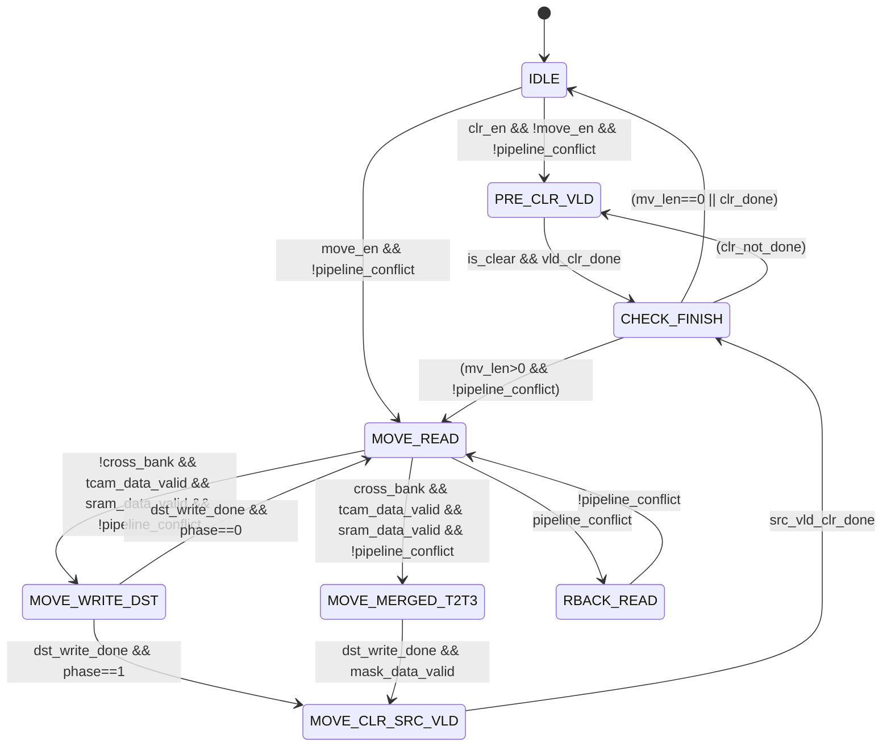

已在 [[ACL搬移无感实现方案]] 中直接完成 v2.7.1 全部更新，以下为更新后的完整文档：

---

## ACL 搬移无感实现方案

---

### 版本记录

| 版本 | 日期 | 变更说明 |
|:-:|:--|:--|
| v1.0 | 2026-07-29 | 初始方案：TCAM 2R 4W + SRAM 1R 2W，vld 最后一步切换 |
| v2.0 | 2026-07-30 | 新增 T0 目的 vld 预清零，T7 原→目 vld 原子切换，新增软件限制 |
| v2.1 | 2026-07-30 | 拆分 T7/T8：适应同一 bank 场景，原、目 vld 分两拍独立操作 |
| v2.2 | 2026-07-30 | 新增搬移地址判断规则（支持正序/逆序搬移），补充错误保护，更新状态机逻辑 |
| v2.3 | 2026-07-30 | 新增清除操作，合并在 PRE_CLR_VLD 状态，优先级低于搬移操作 |
| v2.4 | 2026-07-30 | 精简错误处理机制，明确清除操作不影响 SRAM，修正 mv 寄存器定义 |
| v2.5 | 2026-07-30 | 删除搬移流程中 T5/T6，搬移周期由 9 降为 7，重新排列时序 |
| v2.6 | 2026-07-31 | 基于 TCAM IP 支持 vld 与 Data/Mask 并发读写特性：T0 合入 T2，T1 新增读 vld，T7 合入 T4，搬移周期由 7 降为 5。IP 手册已确认支持并发读、并发写及单独写，依赖风险消除 |
| v2.6.1 | 2026-07-31 | 修正状态转移图：IDLE→PRE_CLR_VLD 增加 `!move_en` 互斥条件，明确搬移优先于清除。约束确认：仅支持同时配置搬移/清除，执行过程中不响应新配置 |
| v2.6.2 | 2026-07-31 | 删除 SRAM T5 原地址清 0 操作：TCAM vld=0 保证原 entry 不可命中，SRAM 残留数据不会被访问。节省每次搬移 1 次 SRAM 写操作，降低动态功耗，同时消除 T5 搜索命中原 entry 时 SRAM 读 0 的潜在竞态 |
| v2.7 | 2026-07-31 | 新增跨 Bank 搬移优化：原/目位于不同 bank 时，TCAM T2+T3 合并、T4+T5 合并，单 entry 搬移周期由 5 降为 3；混合模式按 per-entry 实时判定。跨 bank 场景 vld 切换在同一时钟边沿完成，不存在稳定双 vld 窗口，等效于原子操作 |
| **v2.7.1** | **2026-07-31** | **跨 Bank 并发访问能力确认：TCAM IP 每个 bank 为单端口对应一组接口，定制多 bank TCAM 内部含有多组接口，可同周期访问两个不同 bank。11.2 节由"待确认"转"已确认"，第十二节风险表对应项消除** |

---

### 一、设计目标

1. **搬移/清除无感**：搬移/清除过程中流水线业务不感知、不被反压
2. **数据一致性**：TCAM（`cap_key_t`）与 SRAM（`cap_policy_t`）搬移同步进行，保证数据一一对应
3. **单向搬移**：搬移操作从源地址搬移至目的地址，不涉及双向对换

---

### 二、核心架构

| 组件 | 类型 | 作用 |
|:----|:----|:----|
| CAP_KEY_t | TCAM | 存储 Key 数据，支持三态搜索，输出命中 index |
| CAP_POLICY_t | SRAM | 存储 Policy 数据，TCAM 输出 index 后查表获取动作 |

- 搬移过程中，TCAM 和 SRAM 共用同一组寄存器配置（存放于 `cap_pool` 模块）
- 一次操作最大支持搬移 **2K entry**，以 entry 为颗粒度

---

### 三、仲裁策略

采用**固定优先级仲裁**：

- **流水线访问**：最高优先级
- **搬移操作**：次高优先级
- **清除操作**：最低优先级

**时钟余量分析**：

- 架构时钟：**930MHz**
- 最高包率：**905MHz**
- 余量：**25MHz**，即使冲突持续发生在一个 bank 上，软件不会被一直反压

**约束条件**：

- 搬移/清除操作期间，软件不会下发访问表的命令
- **软件限制**：由于搬移操作不是原子性，搬移过程中某一 entry 数据会按照无效处理
- **配置约束**：仅支持同时配置搬移/清除（二选一），等此次配置结束后再发起下次操作；执行过程中不响应新配置

---

### 四、TCAM 操作流程

#### 4.1 单 entry 搬移流程

搬移流程按 **原/目地址是否跨 bank** 分为两种模式，per-entry 实时判定：

- **同 Bank 场景**：5 cycles（v2.6 基线）
- **跨 Bank 场景**：3 cycles（v2.7 新增）

**跨 bank 判定条件**：

```verilog
wire cross_bank = (src_addr[BANK_BITS] != dst_addr[BANK_BITS]);
```

##### 4.1.1 同 Bank 场景（5 cycles）

基于 TCAM IP 支持 **vld 与 Data/Mask 并发读写** 的特性，将 v2.5 方案中的 T0、T7 分别合入 T2、T4，并在 T1 新增读原 vld 操作。

|   时序   | TCAM 操作                      | SRAM 操作    | 说明                                                           |
| :----: | :--------------------------- | :--------- | :----------------------------------------------------------- |
| **T1** | **读 Data (原) + 读 vld (原)**   | **1R (原)** | 读出原 Data 数据，**同时采样原 vld 存入 `src_vld_q`**，供 T4 使用             |
| **T2** | **写 Data (目) + 写 vld (目清0)** | **1W (目)** | 将原 Data 写入目的 Data 阵列，**同时将目的 vld 置 0**（目的 entry 不参与搜索）       |
|   T3   | 读 Mask (原)                   | —          | 读出原 Mask 阵列数据                                                |
| **T4** | **写 Mask (目) + 写 vld (目=原)** | —          | 将原 Mask 写入目的 Mask 阵列，**同时将 `src_vld_q` 写入目的 vld**            |
| **T5** | **写 vld (原清0)**              | **—**      | **将原 vld 清 0，原 entry 不再参与搜索；SRAM 原地址数据残留，因 vld=0 不可命中，无需清除** |

> **优化要点**：
> 1. **T1 读原 vld**：`src_vld_q` 在 T1 随 Data 读出时一并锁存，为 T4 写目的 vld 提供数据源
> 2. **T2 合并 T0**：写目的 Data 的同时清目的 vld，目的 entry 自 T2 起不参与搜索
> 3. **T4 合并 T7**：写目的 Mask 的同时写入目的 vld，T4 完成后目的 entry 状态与搬移前原 entry 一致
> 4. **原 Data/Mask 残留数据**：T5 清原 vld 后原 entry 不再参与搜索，下次操作数据会被覆盖，无需提前清零
> 5. **SRAM 原地址残留数据**（v2.6.2）：T5 清原 vld 后原 entry 不可命中，SRAM 原地址不会被流水线访问，**无需执行清 0 写操作**，节省动态功耗

##### 4.1.2 跨 Bank 场景（3 cycles，v2.7 新增）

原/目的地址位于不同 bank 时，访问分别落在不同 bank 上，无端口冲突，可**同周期并行**：

|    周期     | TCAM（目的 bank）              | TCAM（原 bank）         | SRAM  | 说明                                       |
| :-------: | :------------------------- | :------------------- | :---- | :--------------------------------------- |
|  **T1**   | —                          | 读 Data(原) + 读 vld(原) | 1R(原) | 采样 `src_vld_q`，SRAM 读原数据                 |
| **T2+T3** | **写 Data(目) + 写 vld(目清0)** | **读 Mask(原)**        | 1W(目) | 原 T2（写目 Data+清目 vld）与 T3（读原 Mask）合入 1 周期 |
| **T4+T5** | **写 Mask(目) + 写 vld(目=原)** | **写 vld(原清0)**       | —     | 原 T4（写目 Mask+写目 vld）与 T5（清原 vld）合入 1 周期  |

**合并依据**：

1. **T2+T3 合并**：T2 访问目的 bank（写 Data + 清目 vld），T3 访问原 bank（读 Mask），跨 bank 时两者落在不同 bank，无端口仲裁冲突
2. **T4+T5 合并**：T4 访问目的 bank（写 Mask + 写目 vld），T5 访问原 bank（清原 vld），跨 bank 时同样无冲突

**IP 结构支持**（v2.7.1 确认）：TCAM IP 每个 bank 为单端口，对应一组独立接口；定制多 bank TCAM 时，内部包含多组接口（每个 bank 一组）。跨 bank 访问时，T2+T3（目 bank 写 + 原 bank 读）与 T4+T5（目 bank 写 + 原 bank 写）分别落在不同 bank 的接口组上，同周期并行无端口仲裁冲突。

**依赖检查**：

| 检查项 | 结论 | 说明 |
|:----|:----:|:----|
| T2 写 Data ← T1 读 Data | ✅ | 数据在 T1 周期末已就绪 |
| T3 读 Mask 与 T2 写 Data 并行 | ✅ | 独立读操作，无数据依赖 |
| T4 写 Mask ← T3 读 Mask | ✅ | T3 数据在 T2+T3 周期末返回，T4 于下一周期使用 |
| T5 清原 vld 使用 `src_vld_q` | ✅ | T1 采样值，非本周期读 |

**跨 Bank 额外收益**：T4+T5 合并后，目的 vld 置 1 与原 vld 清 0 在**同一时钟边沿提交**，不存在稳定双 vld 窗口，vld 切换等效于原子操作（优于同 bank 场景）。

#### 4.2 单 entry 清除流程（共 1 个周期）

清除操作仅需将对应 entry 的 TCAM vld 清 0，**SRAM 无需修改数据**。

| 时序 | 操作 | 说明 |
|:----:|:----|:----|
| **T0** | **写 vld (清0)** | **将清除 entry 的 vld 置为无效（vld=0）** |

**设计要点**：
- 清除操作复用 `PRE_CLR_VLD` 状态中的写 vld 逻辑
- 清除完成后直接进入 `CHECK_FINISH`，无需经过 `MOVE_READ` / `MOVE_WRITE_DST` / `MOVE_CLR_SRC_VLD` 等搬移状态
- **清除操作不涉及 SRAM 读写**，仅操作 TCAM vld

#### 4.3 安全保证分析

**搬移场景（同 Bank，5 cycles）**：

1. **目的 vld 清零保障**（T2）：写目的 Data 的同时清目的 vld，目的 entry 在 T2~T3 期间不参与搜索，Data/Mask 中间态不会影响搜索结果
2. **原 entry 数据完整性**（T1~T4）：原 entry 的 Data/Mask 在搬移过程中保持不变，流水线访问原 entry 时结果正确
3. **原 vld 清0保障**（T5）：搬移完成后原 vld 清 0，原 entry 不再参与搜索
4. **非原子性保障**（T4~T5）：原 vld 与目的 vld 的切换分两拍完成，存在短暂窗口双 vld 同时有效，但不影响流水线业务

**搬移场景（跨 Bank，3 cycles，v2.7 新增）**：

1. **目的 vld 清零保障**（T2+T3）：写目的 Data 的同时清目的 vld，目的 entry 在 T2+T3 期间不参与搜索 ✅
2. **原 entry 数据完整性**（T1~T2+T3）：原 entry 的 Data/Mask 在搬移过程中保持不变，流水线访问原 entry 时结果正确 ✅
3. **原 vld 清0保障**（T4+T5）：搬移完成后原 vld 清 0，原 entry 不再参与搜索 ✅
4. **vld 原子切换**（T4+T5）：目的 vld 置 1 与原 vld 清 0 在**同一时钟边沿提交**，**不存在稳定双 vld 窗口**（优于同 bank 场景）✅

**清除场景**：
1. **清除前**：该 entry 的 vld 被暂时视为无效
2. **清除后**：entry 的 vld=0，Data/Mask 数据可保留，不影响搜索

> **清除操作的安全性**：清除仅清 vld，不修改 Data/Mask 阵列，因此不存在中间态风险。即使流水线在清除操作进行中访问该 entry，vld=0 意味着该 entry 不参与搜索，结果正确。

> **SRAM 残留数据安全性**（v2.6.2）：搬移/清除操作后，原 SRAM 地址数据保留。由于 TCAM 原 entry vld=0 不可命中，TCAM 不会输出原 index，SRAM 原地址永远不会被流水线访问，残留数据不构成安全风险。

#### 4.4 双 vld 边界场景处理

**同 Bank 场景**：
- T4 操作完成后、T5 操作完成前，存在**短暂窗口**源 vld=1 且目的 vld=1
- 当搬移在同一 bank 内进行时，原 vld 与目的 vld **无法实现原子性切换**
- **即使双 vld 同时有效，也不影响流水线业务**：
  1. **TCAM IP 行为**：命中多项时，固定选择 **index 最小**的条目作为输出
  2. **数据一致性**：两处数据均为搬移的一致数据（T1~T4 已将原数据复制到目的地址）
  3. **index 选择正确**：无论命中原 entry 还是目的 entry，输出的 index 均对应正确的 policy 数据

> **v2.6.2 额外保障**：由于 SRAM 原地址数据未被清除，双 vld 窗口期命中原 entry 时，SRAM 读出的是完整的原 policy 数据，结果依旧正确。若执行了 SRAM 清 0，反而会导致窗口期读 0 错误。

**跨 Bank 场景（v2.7）**：
- T4+T5 合并后，目的 vld 置 1 与原 vld 清 0 在**同一时钟边沿提交**
- **不存在稳定双 vld 状态**，无需依赖 TCAM IP 的 index 最小选择机制
- vld 切换等效于原子操作，安全性高于同 bank 场景

#### 4.5 原 vld 无效数据搬移场景

当原 entry 的 vld=0（即原数据无效）时：

1. T1 读出的原 vld=0，`src_vld_q=0`
2. T1~T3 仍然读出并写入 Data/Mask 数据（但数据本身无意义）
3. T4（或跨 bank 的 T4+T5）将 vld=0 写入目的 vld
4. T5（或跨 bank 的 T4+T5）将原 vld 清 0（原 vld 已为 0，写 0 操作无副作用）
5. **搬移完成后**：目的 entry vld=0，原 entry vld=0，**该 entry 始终处于无效状态**

---

### 五、SRAM 操作流程

SRAM（`cap_policy_t`）的搬移操作与 TCAM 同步进行：

**搬移场景**（v2.6.2 更新，删除 T5 清 0）：

| 时序 | 操作 | 说明 |
|:----:|:----|:----|
| T1 | 1R (原) | 读出原来保存的数据 |
| T2 | 1W (目) | 将读出原数据写入目的存储空间 |
| ~~T5~~ | ~~1W (原清0)~~ | **已删除**：TCAM 原 vld=0 保证原 entry 不可命中，SRAM 原地址不会被流水线访问，残留数据无需清除 |

**跨 Bank 场景说明（v2.7）**：

- **SRAM T1+T2 不可合并**：T2 写目的地址的数据正是 T1 从原地址读出的数据，存在**读后写（RAW）数据依赖**。即使原/目位于不同 bank（无端口冲突），写数据也必须等待读数据返回后才能产生，标准同步 SRAM 在 930MHz 下无法在同一周期内完成"读→写"数据传递
- **但 SRAM 不是瓶颈**：跨 bank 合并后 TCAM 需要 3 周期，SRAM 的 2 周期操作（T1 读 + T2 写）完整落在 TCAM 窗口内，**整体 per-entry 周期仍由 TCAM 决定 = 3 cycles**

**清除场景**：
- **清除操作不涉及 SRAM 读写**，仅清除 TCAM 对应 entry 的 vld
- 清除后，TCAM 命中性被禁止，对应 SRAM 数据保持不动，流水线不会访问该 entry 的 policy 数据

---

### 六、同步搬移/清除机制

- 要求开始搬移时，**同时发起**访问 TCAM、SRAM 的操作
- 只有两个操作**同时完成**时，才会进入下一个 entry 搬移动作
- TCAM 是瓶颈（同 bank 搬移 5 cycles/entry，跨 bank 搬移 **3 cycles/entry**，清除 1 cycle/entry），SRAM 等待 TCAM 完成
- **SRAM 操作精简**（v2.6.2）：搬移场景下 SRAM 仅执行 T1 读 + T2 写，T5 无操作，同步等待 TCAM T5（或跨 bank T4+T5）完成后进入下一 entry

---

### 七、状态机设计

#### 7.1 状态转移图



> **修正说明（v2.6.1）**：`IDLE --> PRE_CLR_VLD` 的转移条件由 `clr_en && !pipeline_conflict` 修正为 `clr_en && !move_en && !pipeline_conflict`，增加 `!move_en` 互斥条件，确保搬移/清除同时配置时无歧义，按仲裁优先级执行搬移。

> **v2.7 变更**：新增 `MOVE_MERGED_T2T3` 状态（跨 bank 专用，T2+T3 合并）。从 `MOVE_READ` 出发按 `cross_bank` 信号分流：同 bank 走原 5-cycle 流程，跨 bank 走新 3-cycle 流程。

**状态说明**：

|          状态          |       对应时序        | 描述                                                                                            |
| :------------------: | :---------------: | :-------------------------------------------------------------------------------------------- |
|         IDLE         |         —         | 空闲状态，等待搬移或清除启动；**搬移/清除同时配置时优先执行搬移**（`!move_en` 互斥）                                            |
|     PRE_CLR_VLD      |      T0（清除）       | **仅清除流程**：将目标 entry 的 vld 清 0；搬移流程不再经过此状态                                                     |
|      MOVE_READ       |      T1 / T3      | 仅搬移流程：同时发起 TCAM 和 SRAM 读请求；`phase=0` 时读 Data+vld，`phase=1` 时读 Mask（仅同 bank）                   |
| **MOVE_MERGED_T2T3** | **T2+T3（跨 bank）** | **跨 bank 专用（v2.7 新增）：写目的 Data + 清目 vld（目 bank）与读原 Mask（原 bank）同周期并行**                         |
|      RBACK_READ      |         —         | 被流水线反压时回退，保持已读数据，等待冲突解除                                                                       |
|    MOVE_WRITE_DST    |      T2 / T4      | 仅搬移流程（同 bank）：`phase=0` 时写 Data+清目 vld，`phase=1` 时写 Mask+写目 vld                               |
|   MOVE_CLR_SRC_VLD   |    T5 / T4+T5     | 仅搬移流程：**同 bank** 仅清原 vld（SRAM 无操作）；**跨 bank** 同时写目 Mask+写目 vld（目 bank）与清原 vld（原 bank）并行（v2.7） |
|     CHECK_FINISH     |         —         | 检查是否完成，更新地址/计数器；**执行过程中不响应新配置，操作完成后回到 IDLE 接收新命令**                                            |

> **关键变更**：搬移流程不再经过 `PRE_CLR_VLD` 状态，该状态成为清除操作专用；`MOVE_VLD_SWITCH`（原 T7/T8）由 `MOVE_CLR_SRC_VLD`（T5 清原 vld）替代。

#### 7.2 清除操作优先级逻辑

```verilog
// 仲裁优先级：流水线 > 搬移 > 清除
assign clr_ready = clr_en && !move_busy;  // 搬移进行时，清除等待
assign move_ready = move_en;               // 搬移具有更高优先级
```

**清除操作流程**：
1. 软件配置 `clr_en=1`，设置 `clr_from`、`clr_to` 清除范围
2. 硬件检测到 `clr_en` 有效且无搬移进行中，启动清除
3. 每次清除一个 entry（写 vld=0），地址递增，直到 `clr_addr > clr_to`
4. 清除完成后 `clr_en` 自动清 0

#### 7.3 反压回退机制

```verilog
typedef enum {IDLE, PRE_CLR_VLD, MOVE_READ, MOVE_MERGED_T2T3,
              MOVE_WRITE_DST, MOVE_CLR_SRC_VLD, CHECK_FINISH,
              RBACK_READ} state_t;
reg is_move;       // 1:搬移操作, 0:清除操作
reg [1:0] phase;   // 0:Data阶段(T1/T2), 1:Mask阶段(T3/T4)
reg src_vld_q;     // T1 采样的原 vld 值
reg cross_bank_q;  // T1 周期锁存的跨 bank 判定结果（v2.7）

always @(posedge clk) begin
    case (state)
        IDLE: begin
            if (pipeline_conflict)
                state <= IDLE;
            else if (move_en) begin        // 搬移优先：先判断 move_en
                is_move <= 1'b1;
                phase <= 2'b00;
                state <= MOVE_READ;
            end
            else if (clr_en && !move_busy) begin  // 清除仅在无搬移请求时启动
                is_move <= 1'b0;
                state <= PRE_CLR_VLD;
            end
        end
        PRE_CLR_VLD: begin
            // 清除：T0 写 vld (清0)
            if (vld_clr_done)
                state <= CHECK_FINISH;
        end
        MOVE_READ: begin
            // T1: 读 Data+vld + SRAM 1R（phase=0）
            // T3: 读 Mask（phase=1，仅同 bank）
            if (pipeline_conflict)
                state <= RBACK_READ;
            else if (tcam_data_valid && sram_data_valid) begin
                cross_bank_q <= cross_bank;  // v2.7: 锁存跨 bank 判定
                if (cross_bank_q)
                    state <= MOVE_MERGED_T2T3;   // v2.7: 跨 bank 走合并流程
                else
                    state <= MOVE_WRITE_DST;     // 同 bank 走原流程
            end
        end
        RBACK_READ: begin
            // 保持已读数据，等待流水线空闲
            if (!pipeline_conflict)
                state <= MOVE_READ;
        end
        MOVE_MERGED_T2T3: begin
            // v2.7: 跨 bank T2+T3 合并
            // 写 Data(目) + 写 vld(目清0) | 读 Mask(原) + SRAM 1W(目)
            if (dst_write_done && mask_data_valid)
                state <= MOVE_CLR_SRC_VLD;  // 直接进入 T4+T5 合并
        end
        MOVE_WRITE_DST: begin
            // T2: 写 Data(目) + 写 vld(目清0)（phase=0）
            // T4: 写 Mask(目) + 写 vld(目=src_vld_q)（phase=1）
            if (dst_write_done && phase==2'b00) begin
                phase <= 2'b01;
                state <= MOVE_READ;      // 进入 Mask 阶段（同 bank）
            end
            else if (dst_write_done && phase==2'b01)
                state <= MOVE_CLR_SRC_VLD;
        end
        MOVE_CLR_SRC_VLD: begin
            // 同 bank: T5 写 vld(原清0)，SRAM 无操作（v2.6.2）
            // 跨 bank: T4+T5 合并（v2.7）
            //   写 Mask(目) + 写 vld(目=src_vld_q) | 写 vld(原清0)
            if (src_vld_clr_done)  // 跨 bank 时同时等待 dst_vld_write_done
                state <= CHECK_FINISH;
        end
        CHECK_FINISH: begin
            // 执行过程中不响应新配置，等操作完成后再回到 IDLE 接收新命令
            if (is_move)
                state <= (mv_len == 0) ? IDLE : MOVE_READ;
            else
                state <= (clr_done) ? IDLE : PRE_CLR_VLD;
        end
        default: state <= IDLE;
    endcase
end
```

**关键设计要点**：
- **phase 寄存器**：区分 Data 阶段（T1/T2）与 Mask 阶段（T3/T4），仅同 bank 流程使用；跨 bank 流程通过 `MOVE_MERGED_T2T3` 状态直接完成两个阶段
- **`cross_bank_q` 锁存**（v2.7）：在 `MOVE_READ`（T1）周期锁存跨 bank 判定结果，指导后续状态转移
- **`src_vld_q` 锁存**：T1 读出的原 vld 值锁存至 `MOVE_WRITE_DST`（同 bank phase=1）或 `MOVE_CLR_SRC_VLD`（跨 bank）使用，作为写目的 vld 的数据源
- **反压回退**：被流水线反压时回退并**保持已读数据**，流水线空闲后立即恢复；回退发生在 `MOVE_READ` 周期，`cross_bank_q` 尚未锁存，无状态残留问题
- **配置互斥**：IDLE 态先判断 `move_en` 再判断 `clr_en`，搬移/清除同时配置时优先执行搬移
- **无抢占**：执行过程中不响应新配置，清除流程无搬移抢占分支（配置约束保证）
- **T5 仅操作 TCAM**（v2.6.2）：`MOVE_CLR_SRC_VLD` 状态仅等待 TCAM vld 写完成，SRAM 无写操作

---

### 八、搬移地址判断与更新

通过 `cap_pool` 模块的寄存器 `mv_en`、`mv_from`、`mv_to`、`mv_len` 配置搬移范围。

#### 8.1 寄存器定义

| 字段 | 类型 | 功能 |
|:----|:----:|:----|
| `mv_en` | WO | 搬移使能，操作完成后自动清 0 |
| `mv_from` | WO | 搬移原数据起始地址 |
| `mv_to` | WO | 搬移目的地址 |
| `mv_len` | WO | 搬移长度，每次搬移完成后减 1，减至 0 时结束 |

#### 8.2 搬移方向判断

- **正序搬移**（`mv_from < mv_to`）：从低地址向高地址搬移，原地址从 `mv_from` 递增，目的地址从 `mv_to` 递减
- **逆序搬移**（`mv_from > mv_to`）：从高地址向低地址搬移，原地址从 `mv_from` 递减，目的地址从 `mv_to` 递增
- **地址重叠场景**：通过正序/逆序判断保证重叠区间数据不丢失

#### 8.3 搬移完成条件

- 每次搬移一个 entry 后，`mv_len` 减 1
- 当 `mv_len == 0` 时，结束本次搬移操作，`mv_en` 自动清 0

#### 8.4 错误保护

- 若配置 `mv_from == mv_to`，表示无需搬移，硬件直接清 `mv_en`
- 若搬移地址超出 CAP 地址范围（> 2K-1），视为错误配置，硬件复位 `mv_en`

---

### 九、清除操作实现

#### 9.1 清除操作流程

1. 软件配置 `clr_from`、`clr_to`，置位 `clr_en`
2. 硬件检测到 `clr_en` 有效，进入清除流程
3. 每次清除一个 entry（写 TCAM vld=0），地址从 `clr_from` 递增到 `clr_to`
4. 每个 entry 清除需 **1 cycle**（写 vld），**SRAM 不做任何操作**
5. 清除完成后 `clr_en` 自动清 0

**地址范围检查**：
- 若 `clr_from > clr_to`，视为错误配置，硬件复位 `clr_en`
- 若清除地址超出 CAP 地址范围，同样视为错误配置，复位 `clr_en`

#### 9.2 优先级规则

- **流水线访问** > **搬移操作** > **清除操作**
- 搬移进行中时，清除操作被阻塞，等待搬移完成后再执行
- **仅支持同时配置搬移/清除（二选一），等此次配置结束后再发起下次操作**

---

### 十、性能评估

| 操作              |  每 entry 耗时  | 2K entry 总耗时（930MHz） |
| :-------------- | :----------: | :------------------: |
| 搬移（同 bank）      | **5 cycles** |     **≤ 10.8μs**     |
| 搬移（跨 bank，v2.7） | **3 cycles** |  **≤ 6.5μs**（↓40%）   |
| 清除              | **1 cycle**  |     **≤ 2.2μs**      |

**混合模式**：同一搬移范围内可能交错出现同 bank/跨 bank 条目，实际总耗时介于 6K ~ 10K cycles 之间，由搬移范围内跨 bank 条目占比决定。

**功耗优化**（v2.6.2）：
- SRAM 搬移操作由 3 次（T1 1R、T2 1W、T5 1W）减为 **2 次**（T1 1R、T2 1W）
- 每次搬移节省 1 次 SRAM 写操作，动态功耗降低约 **33%**
- 2K entry 搬移共节省 2K 次 SRAM 写操作

**跨 Bank 额外功耗收益**（v2.7）：
- TCAM 操作由 5 周期减为 3 周期，TCAM 动态功耗降低约 **40%**（全跨 bank 场景）

---

### 十一、IP 能力确认

#### 11.1 已确认能力（vld 与 Data/Mask 并发读写）

**IP 手册已明确支持 vld 与 Data/Mask 并发读、并发写及单独写**，v2.6 方案的时序优化前提全部成立。

| 能力项 | 手册支持 | 方案依赖 | 状态 |
|:----|:----:|:----|:----:|
| **vld 与 Data 并发读** | ✅ | T1 读原 Data + 读原 vld，采样 `src_vld_q` | **已确认** |
| **vld 与 Data 并发写** | ✅ | T2 写目的 Data + 写目的 vld（清0） | **已确认** |
| **vld 与 Mask 并发写** | ✅ | T4 写目的 Mask + 写目的 vld（=原 vld） | **已确认** |
| **vld 单独写** | ✅ | T5 写原 vld（清0） | **已确认** |

> 该确认消除了此前标记为"待确认"的 IP 依赖风险，5 周期搬移时序具备完整的 IP 手册依据。Valid 位由 `VBE` + `VBI` 独立控制，可伴随 Data/Mask 操作并发进行，支持单独读、单独写。

#### 11.2 跨 Bank 并发访问能力（v2.7.1 已确认）

| 能力项 | 支持方式 | 方案依赖 | 状态 |
|:----|:----|:----|:----:|
| **同周期访问两个不同 bank**（一个 bank 写、另一个 bank 读） | ✅ 每个 bank 单端口对应一组独立接口，多 bank 定制内部含多组接口 | T2+T3 合并：目 bank 写 Data + 原 bank 读 Mask | **已确认** |
| **同周期访问两个不同 bank**（一个 bank 写、另一个 bank 写） | ✅ 同上 | T4+T5 合并：目 bank 写 Mask/vld + 原 bank 清 vld | **已确认** |

> **确认说明**：TCAM IP 的 bank 为单端口结构，每组接口独立服务一个 bank。定制多 bank TCAM 时，内部自然包含多组接口，跨 bank 操作落在不同接口组上，同周期并行无需仲裁。此确认消除了 v2.7 中最后一项 IP 依赖风险。

---

### 十二、风险点与总结

| 风险点 | 解决方案 | 风险等级 |
|:----|:----|:----:|
| ~~IP 并发读写能力待确认~~ | **IP 手册已明确支持 vld 与 Data/Mask 并发读、写及单独写** | **已消除** |
| ~~跨 bank 并发访问能力待确认（v2.7）~~ | **TCAM IP 每个 bank 单端口对应一组接口，多 bank 定制内部含多组接口，可同周期访问不同 bank（v2.7.1 确认）** | **已消除** |
| 目的地址残留数据 | T2（或跨 bank T2+T3）写目的 Data 同时清目的 vld | **低** |
| TCAM 双阵列中间态 | 目的 vld=0 期间 Data/Mask 不参与搜索 | **低** |
| 目的 vld 未提前清零窗口（T1） | 软件限制：搬移目的地址应为预留空闲区 | **低** |
| 双 vld 边界窗口（同 bank） | TCAM IP 固定选择 index 最小条目，两处数据一致，不影响业务 | **低** |
| 双 vld 边界窗口（跨 bank，v2.7） | T4+T5 合并，vld 切换在同一边沿提交，**不存在稳定双 vld 窗口** | **已消除** |
| 原 vld 无效数据搬移 | T4（或跨 bank T4+T5）统一搬移 vld 值，T5 清 0，软件限制保证正确性 | **低** |
| 地址重叠覆盖 | 搬移地址正序/逆序判断保证重叠区间数据不丢失 | **低** |
| 原 Data/Mask 残留数据 | T5（或跨 bank T4+T5）清原 vld 后原 entry 不再参与搜索，下次操作会覆盖，无需提前清零 | **低** |
| **SRAM 原地址残留数据（v2.6.2）** | **T5 清原 vld 后原 entry 不可命中，SRAM 原地址不被流水线访问；软件复用地址时先写 SRAM 再置 vld=1** | **低** |
| 清除操作与搬移冲突 | 清除优先级低于搬移，搬移进行时阻塞清除；**同时配置时 IDLE 态 `!move_en` 互斥保证优先搬移** | **低** |
| 清除过程中流水线访问 | 清除仅清 vld，Data/Mask 不变，vld=0 的 entry 不参与搜索 | **低** |
| 执行过程中新配置到达 | **配置约束**：不支持执行过程中配置下发，仅支持同时配置，等操作完成后再发起下次 | **低** |
| 混合模式状态机复杂度（v2.7） | 新增 `MOVE_MERGED_T2T3` 状态 + `cross_bank_q` 锁存，按 per-entry 实时分流 | **中** |

---

### 验证建议

验证时重点构造以下边界场景测试用例：

- 搬移过程中原 entry vld=0 的场景
- 搬移过程中流水线持续命中同一 bank
- 搬移在同一 bank 内进行时，T4~T5 窗口期双 vld 同时有效的搜索行为
- 搬移被反压后恢复的时序正确性
- 搬移地址区间重叠时（`mv_from > mv_to` 和 `mv_from < mv_to` 两种方向）的数据一致性
- **搬移完成后，原 entry Data/Mask 残留数据是否影响后续搜索（不应影响，因 vld=0）**
- **搬移完成后，SRAM 原地址残留数据是否会被流水线读回（不应被读回，因 TCAM 原 vld=0 不可命中）**
- **双 vld 窗口期（T4~T5）命中原 entry 时，SRAM 读出的是否为完整原 policy 数据（v2.6.2 保证）**
- **对比验证：删除 SRAM T5 清 0 前后，搬移结果一致（功能不变，仅省功耗）**
- **软件复用搬移后原地址时，按"先写 SRAM 再写 TCAM key + 置 vld"顺序操作的正确性**
- **T1 读原 vld 采样 `src_vld_q` 的时序正确性（与 Data 同周期读出的对齐）**
- **T4 写目的 vld = `src_vld_q` 的路径延迟是否满足时序要求**
- **搬移/清除同时配置时（`move_en=1` 且 `clr_en=1`），IDLE 态仲裁是否优先执行搬移**
- **清除操作进行中，流水线访问被清除 entry 的行为**
- **清除与搬移交替执行的正确性（等当前配置操作完成后，再发起下次配置）**
- **跨 bank 搬移功能验证（v2.7）**：构造原/目地址跨 bank 的搬移场景，验证 3-cycle 流程数据一致性
- **跨 bank 搬移 vld 原子切换验证（v2.7）**：T4+T5 合并后，验证搜索行为中不存在双 vld 同时命中的窗口
- **混合模式验证（v2.7）**：同一搬移范围内交错包含同 bank/跨 bank 条目，验证 per-entry 模式选择正确性
- **`cross_bank_q` 锁存验证（v2.7）**：反压发生在 T1 周期时，回退恢复后跨 bank 判定结果是否正确
- **跨 bank 并发访问实测（v2.7.1）**：构造原/目地址跨 bank 场景，验证多接口组同周期独立并行读写无串扰、数据正确

---

#### Sources
[^1]: [[ACL搬移无感实现方案]]
[^2]: [[跨Bank搬移操作周期说明@20260731_114402]]
[^3]: [[TCAM搬移风险评审@20260730_112117]]
[^4]: [[数字电路文档准确性@20260731_085010]]
[^5]: [[搬移地址判断规则@20260730_154855]]
[^6]: [[致 TCAM IP Vendor 咨询问题]]